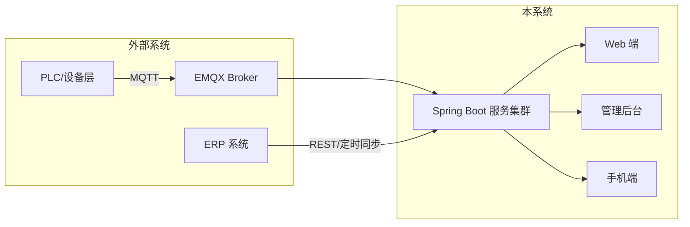

# Software Design Document Skill

为基于 Spring Boot 的工业数字工厂 / 项目管理系统生成高质量设计文档。

---

## 使用时机

用户提到以下任一关键词时立即触发：
- 设计文档、软件设计、系统设计、架构设计
- 概要设计、详细设计、技术方案
- 数据库规范、接口规范
- 数字工厂、工业 IoT、项目管理系统

---

## 工作流程

### Step 1 — 信息收集

在开始写文档之前，先向用户确认以下信息（未提供的项才需要询问）：

| 信息项 | 说明 |
|--------|------|
| 系统名称 | 本系统的名称 |
| 核心业务域 | 数字工厂 / 项目管理 / 两者都有 |
| 主要模块 | 用户列出的核心功能模块 |
| 外部依赖 | 对接哪些外部系统（ERP、MES、第三方平台等） |
| 技术组件 | 实际使用的中间件（MySQL/Redis/MongoDB/EMQX/RabbitMQ 等） |
| 重难点业务 | 需要详细说明的复杂流程 |
| 输出格式 | Markdown 还是 Word（.docx） |

若用户已在需求中提供上述信息，直接进入 Step 2，不要重复询问。

---

### Step 2 — 文档结构

按以下四章生成文档。每章写作原则：**言简意赅，逻辑清晰，避免套话**。

---

#### 第一章：概要设计

**1.1 系统定位**
- 一句话描述系统目标和价值
- 用户群体（工厂操作员、管理层、项目经理…）

**1.2 系统关系图**
用 Mermaid `graph LR` 或 `C4Context` 描述本系统与外部系统的边界和交互：
- 上游：数据来源（ERP、设备/PLC、EMQX broker）
- 下游：数据消费（报表、移动端、第三方 API）
- 内部：Web 端、管理后台、手机端 App

示例结构（根据实际调整）：


**1.3 模块划分**
用简洁的列表或表格说明各模块职责，避免罗列 CRUD，聚焦核心能力：

| 模块 | 核心职责 |
|------|---------|
| 设备管理 | 设备档案、在线状态监控、告警订阅 |
| 生产执行 | 工单下达、工序流转、实绩采集 |
| … | … |

---

#### 第二章：详细设计

**原则**：只对"重难点"业务做详细说明，常规 CRUD 不写流程图。

每个重难点业务按以下格式组织：

```
##### 业务名称

**背景**：一到两句话说明为什么这个流程复杂/重要。

**流程说明**（选择最适合的 UML 形式）：
[Mermaid 图]

**关键设计决策**：
- 决策点 1 及理由
- 决策点 2 及理由
```

**UML 图类型选择指南**：

| 场景 | 推荐图类型 |
|------|-----------|
| 多角色协作审批 | 泳道图（`flowchart LR` + subgraph） |
| 有状态的实体流转（工单、设备） | 状态机图（`stateDiagram-v2`） |
| 系统间调用链路 | 时序图（`sequenceDiagram`） |
| 单一业务决策逻辑 | 流程图（`flowchart TD`） |

**常见重难点（按实际选用）**：
- 设备实时数据采集与告警（MQTT → EMQX → Spring Boot → WebSocket 推送）
- 工单/审批多级流转（状态机 + 消息队列解耦）
- 移动端离线数据同步策略
- 大数据量报表异步生成（RabbitMQ + 任务队列）
- 多租户数据隔离
- 消息幂等与重复消费处理

详细图示规范见 `references/uml-patterns.md`。

---

#### 第三章：数据库 / 接口规范

**不直接设计 schema 和 API**，只声明统一规范，供开发团队遵守。

**3.1 数据库规范**

```
MySQL（关系型主库）
├── 命名：表名 snake_case，前缀按模块（如 prod_work_order）
├── 必备字段：id BIGINT PK、created_at、updated_at、deleted（逻辑删除）
├── 字符集：utf8mb4，排序规则 utf8mb4_unicode_ci
├── 索引：查询字段必建索引，禁止冗余索引；联合索引遵循最左前缀
└── 不存储大对象（文件用 OSS，路径存 DB）

Redis（缓存 / 会话 / 分布式锁）
├── Key 命名：{appName}:{module}:{type}:{id}，如 dfms:device:status:1001
├── 必须设置 TTL，禁止永久 Key（配置类除外）
└── 使用 Lua 脚本保证原子操作

MongoDB（时序 / 非结构化数据）
├── 集合命名：snake_case，如 device_metrics
├── 必须建立 TTL 索引（历史数据自动清理）
└── 避免超大文档（单文档 < 1 MB）
```

**3.2 接口规范**

```
REST API
├── 风格：RESTful，统一前缀 /api/v{n}/
├── 响应结构：{ code, message, data, timestamp }
│   code: 0=成功，非0=业务错误，HTTP 状态码表示传输层错误
├── 分页：?page=1&size=20，响应带 total
├── 时间：统一 ISO 8601（UTC），前端自行转换时区
└── 版本：Breaking change 升 v 号，向前兼容保留旧版本 6 个月

WebSocket（实时推送）
├── 连接路径：/ws/realtime，携带 JWT 认证
├── 消息格式：{ type, payload, timestamp }
└── 心跳：客户端 30s 一次 ping，服务端 60s 无消息则断开

内部服务间（如需）
└── 优先 HTTP REST，性能敏感场景考虑 RabbitMQ 异步解耦
```

---

#### 第四章：安全 / 性能

**只列出本系统必须关注的项，不写通用废话。**

**4.1 安全**

| 项目 | 措施 |
|------|------|
| 认证 | JWT（Access Token 2h + Refresh Token 7d），Redis 存黑名单 |
| 鉴权 | RBAC：角色-资源-操作三级控制，接口层注解声明权限 |
| 数据隔离 | 多租户场景：所有查询强制带 tenant_id，禁止跨租户访问 |
| 敏感数据 | 手机号/身份证等字段存储时脱敏或加密（AES-256） |
| MQTT 安全 | EMQX 启用客户端证书认证，禁止匿名连接 |
| 操作审计 | 核心写操作记录 audit_log（操作人、时间、变更前后） |

**4.2 性能**

| 场景 | 措施 |
|------|------|
| 设备数据高频写入 | 批量写入 + 异步落库（MQ 缓冲），避免每条数据同步入 DB |
| 热点查询 | Redis 缓存设备状态、字典、权限数据，TTL ≤ 5min |
| 大列表/报表 | 禁止全量查询；报表走异步任务生成，完成后通知下载 |
| 数据库 | 读写分离（主写从读）；慢查询监控阈值 500ms |
| 接口限流 | 网关层按 IP/用户限流（令牌桶），防止接口滥用 |

---

### Step 3 — 输出格式

**Markdown 格式**（默认）：
- 直接在对话中输出，Mermaid 图用代码块包裹
- 提供可复制的完整文档

**Word 格式**（用户明确要求时）：
- 先读取 `/mnt/skills/public/docx/SKILL.md` 获取 docx 生成指引
- 用 python-docx 生成 `.docx` 文件
- Mermaid 图先用 `mmdc` 渲染为 PNG 后插入文档

---

### Step 4 — 质量 Checklist

输出前自检：

- [ ] 概要设计中有系统关系图（非文字描述）
- [ ] 每个重难点业务都有对应 UML 图，而不是纯文字
- [ ] 数据库规范覆盖本项目实际使用的所有中间件
- [ ] 安全/性能章节没有与本系统无关的通用条目
- [ ] 全文无空洞套话（如"高可用"、"高性能"未解释）
- [ ] Mermaid 语法正确可渲染

---

## 参考资源

- `references/uml-patterns.md` — 常用 Mermaid 图模板（设备告警、审批流、状态机）
- `references/component-guide.md` — 各中间件在本业务域的典型用途说明