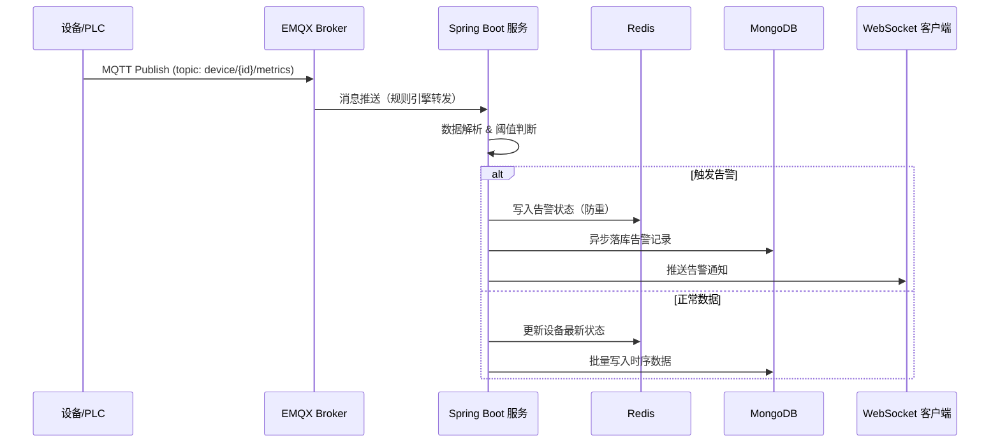
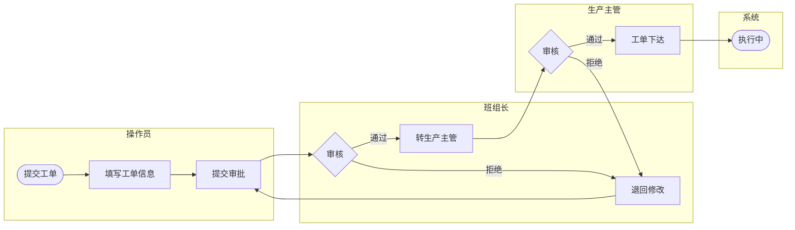
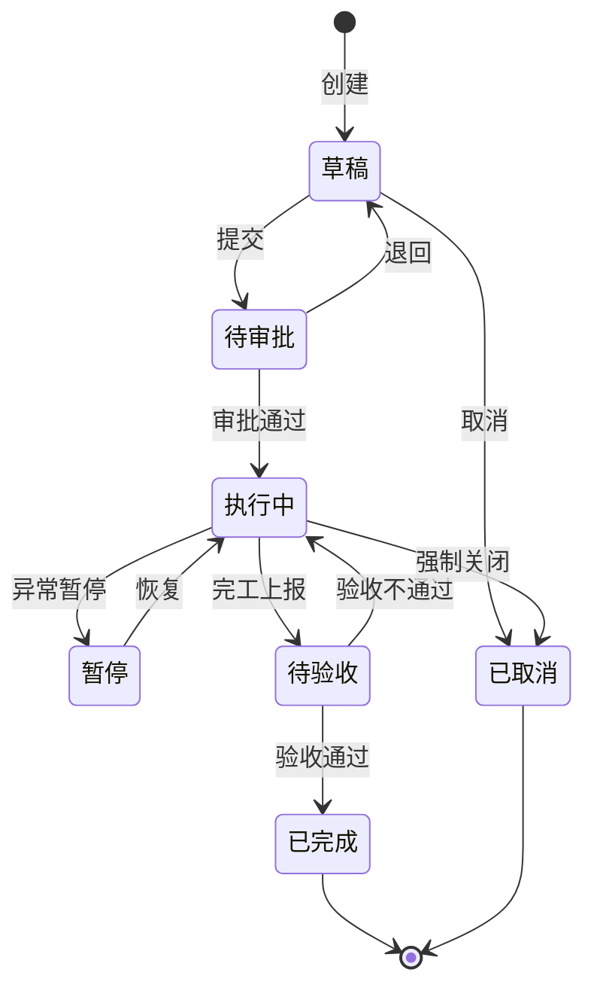
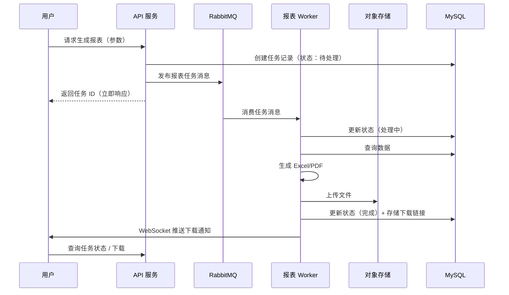
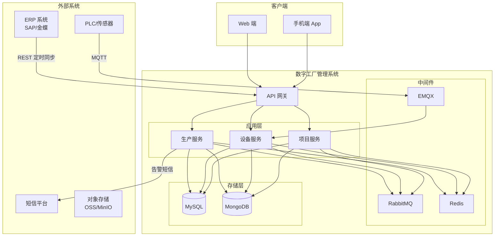
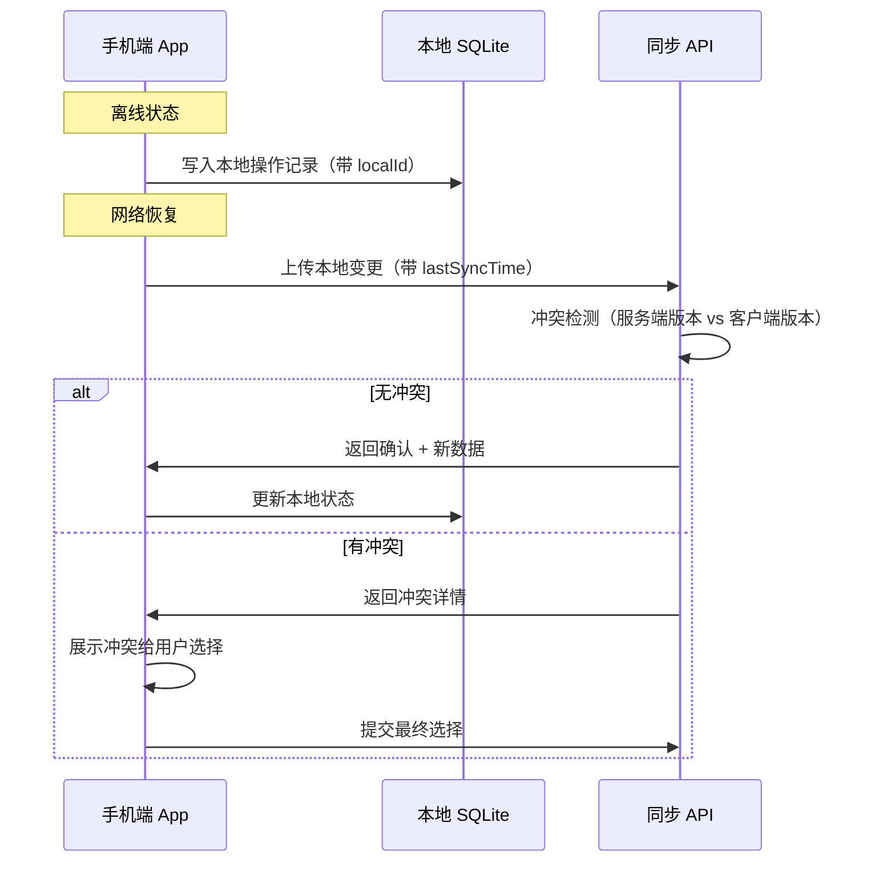
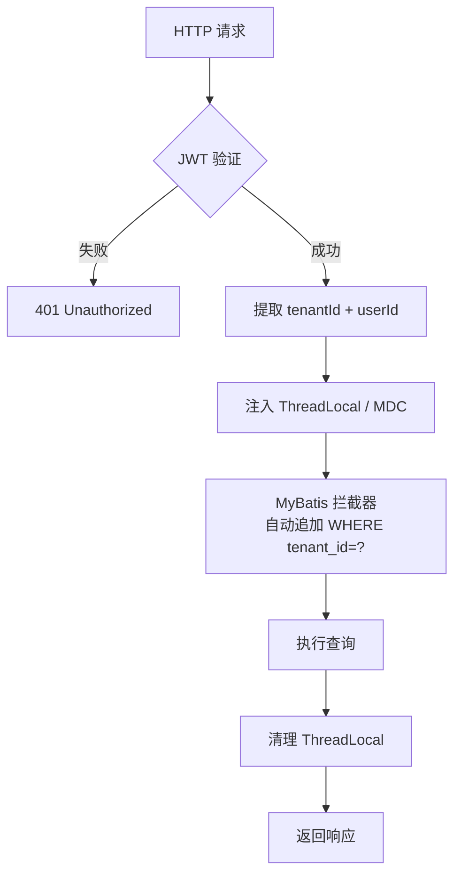

# UML 图模板参考

本文件提供数字工厂 / 项目管理系统中最常用的 Mermaid 图模板，按需选用。

---

## 1. 设备实时数据采集 — 时序图

---

## 2. 工单多级审批 — 泳道图

---

## 3. 工单状态机 — stateDiagram

---

## 4. 报表异步生成 — 时序图

---

## 5. 系统上下文 — C4 Context 风格

---

## 6. 移动端离线同步 — 时序图

---

## 7. 多租户数据隔离 — 流程图

