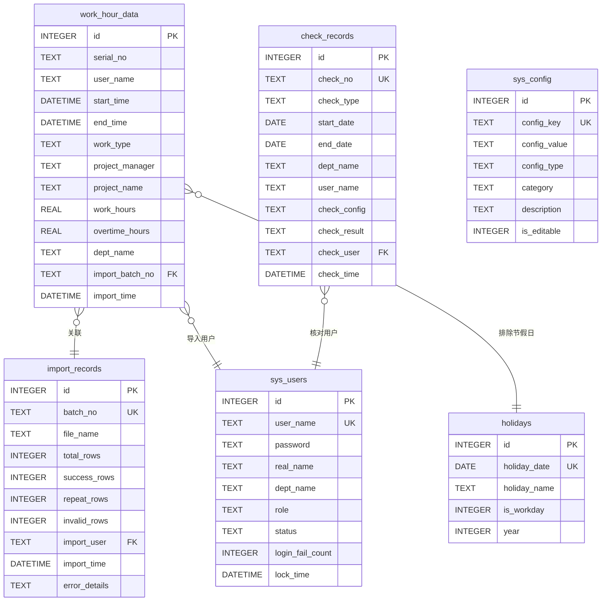

# 项目工时统计WEB软件数据库详细设计

## 一、基本信息

|字段名称|内容|
|---|---|
|文档版本|V1.2.0|
|文档作者|全栈软件开发工程师|
|创建日期|2026-01-15|
|最后更新|2026-01-23|
|关联文档|《架构设计说明书 V1.3.0》《需求规格书 V1.2.0》|
|数据库类型|SQLite 3|
|字符集|UTF-8|

## 二、数据库概述

### 2.1 设计原则

- **极简优先**：仅存储必要字段，避免冗余
- **性能优先**：为高频查询字段创建索引
- **可扩展性**：预留扩展字段，便于未来功能迭代
- **数据完整性**：通过外键、约束保证数据一致性

### 2.2 表清单

|表名|用途|记录数预估|重要级别|
|---|---|---|---|
|work_hour_data|工时数据主表|10万+|核心|
|import_records|导入批次记录表|1千+|重要|
|check_records|核对批次记录表|1千+|重要|
|sys_users|系统用户表|50+|核心|
|sys_config|系统配置表|20+|辅助|
|holidays|节假日表|50+|辅助|

---

## 三、核心数据表设计

### 3.1 工时数据表（work_hour_data）

#### 3.1.1 表结构

存储从钉钉OA审批导入的工时数据，是系统的核心数据表。Excel采用两层表头设计，一个序号（工单）可能包含多种工时类型，导入时拆分为多条数据库记录。

```sql
CREATE TABLE work_hour_data (
    -- 主键
    id INTEGER PRIMARY KEY AUTOINCREMENT,

    -- 钉钉原始数据字段
    serial_no TEXT NOT NULL DEFAULT '',                -- 序号（工单号）
    user_name TEXT NOT NULL,                           -- 姓名
    start_time DATE NOT NULL,                          -- 开始日期（yyyy-MM-dd）
    end_time DATE NOT NULL,                            -- 结束日期（yyyy-MM-dd）
    work_type TEXT NOT NULL DEFAULT 'project_delivery', -- 工时类型：project_delivery/product_research/presales_support/dept_internal/leave
    project_manager TEXT,                              -- 项目经理
    project_name TEXT NOT NULL,                        -- 项目名称（请假记录可为NULL）
    work_hours REAL NOT NULL,                          -- 工作时长（请假记录为0）
    overtime_hours REAL DEFAULT 0,                     -- 加班时长（请假记录为0）
    leave_hours REAL DEFAULT 0,                        -- 请假时长（仅请假记录有值）
    work_content TEXT,                                 -- 工作内容
    approval_result TEXT NOT NULL DEFAULT '通过',      -- 审批结果
    approval_status TEXT NOT NULL DEFAULT '已完成',    -- 审批状态
    dept_name TEXT NOT NULL,                           -- 部门名称

    -- 系统扩展字段
    import_batch_no TEXT NOT NULL,                     -- 导入批次号
    import_time DATETIME NOT NULL DEFAULT (datetime('now', 'localtime')),  -- 导入时间
    created_at DATETIME NOT NULL DEFAULT (datetime('now', 'localtime')),  -- 记录创建时间
    updated_at DATETIME NOT NULL DEFAULT (datetime('now', 'localtime'))   -- 记录更新时间

    -- 表级约束（SQLite不支持CHECK的复杂约束，在应用层实现）
);

-- 创建索引
CREATE INDEX idx_work_hour_data_start_time ON work_hour_data(start_time);
CREATE INDEX idx_work_hour_data_user_name ON work_hour_data(user_name);
CREATE INDEX idx_work_hour_data_dept_name ON work_hour_data(dept_name);
CREATE INDEX idx_work_hour_data_project_name ON work_hour_data(project_name);
CREATE INDEX idx_work_hour_data_import_batch_no ON work_hour_data(import_batch_no);
CREATE INDEX idx_work_hour_data_serial_no ON work_hour_data(serial_no);
CREATE INDEX idx_work_hour_data_work_type ON work_hour_data(work_type);
CREATE INDEX idx_work_hour_data_composite ON work_hour_data(user_name, start_time, project_name, work_type);

-- 添加表注释（SQLite使用注释）
-- work_hour_data: 工时数据主表，存储从钉钉OA审批导入的所有有效工时记录
-- 一条Excel记录按4种工时类型拆分为多条数据库记录，请假记录单独拆分
```

#### 3.1.2 字段详细说明

|字段名|类型|长度|非空|默认值|索引|说明|
|---|---|---|---|---|---|---|
|id|INTEGER|-|是|自增|PK|主键|
|serial_no|TEXT|50|否|''|✅|钉钉OA审批记录序号（工单号），用于按工单聚合工作时长|
|user_name|TEXT|50|是|-|✅|提交OA审批的人员姓名|
|start_time|DATE|-|是|-|✅|工作开始日期，格式yyyy-MM-dd，按天统计工时|
|end_time|DATE|-|是|-|-|工作结束日期，格式yyyy-MM-dd，必须≥开始日期|
|**work_type**|**TEXT**|**50**|**是**|**'project_delivery'**|**✅**|**工时类型（5个枚举值，见下表）**|
|project_manager|TEXT|50|否|-|-|对应项目的项目经理姓名|
|project_name|TEXT|100|是|✅|✅|工作所属的项目名称（请假记录可为NULL）|
|work_hours|REAL|-|是|-|-|实际工作时长，单位：小时，支持1位小数，≥0（请假记录为0）|
|overtime_hours|REAL|-|否|0|-|加班时长，单位：小时，支持1位小数，≥0且≤work_hours（请假记录为0）|
|**leave_hours**|**REAL**|**-**|**否**|**0**|**-**|**请假时长，单位：小时，支持1位小数，≥0（仅请假记录有值）**|
|work_content|TEXT|500|否|-|-|具体工作内容描述|
|approval_result|TEXT|10|是|'通过'|-|OA审批结果，系统仅存储"通过"的数据|
|approval_status|TEXT|10|是|'已完成'|-|OA审批状态，系统仅存储"已完成"的数据|
|dept_name|TEXT|50|是|✅|✅|提交OA审批人员所属部门，核心查询条件|
|import_batch_no|TEXT|50|是|-|✅|导入批次号，关联导入记录表，格式：IMP_YYYYMMDDHHMMSS_XXXX|
|import_time|DATETIME|-|是|now|✅|数据导入系统的时间|
|created_at|DATETIME|-|是|now|-|记录创建时间（技术字段）|
|updated_at|DATETIME|-|是|now|-|记录更新时间（技术字段）|

**工时类型（work_type）枚举值说明：**

|枚举值|中文名称|Excel大类|工作时长字段|加班时长字段|请假时长字段|项目名称字段|说明|
|---|---|---|---|---|---|---|---|
|project_delivery|项目交付|【项目交付工时】|项目交付-工作时长|项目交付-加班时长|-|项目交付-项目名称|外部项目交付工时|
|product_research|产研项目|【产研项目工时】|产品-工作时长|产品-加班时长|-|产品-项目名称|内部产品研发工时|
|presales_support|售前支持|【售前支持工时】|售前-工作时长|售前-加班时长|-|售前-项目名称|售前支持活动工时|
|dept_internal|部门内务|【部门内务工时】|部门-工作时长|部门-加班时长|-|部门-项目名称|部门内部管理工时|
|**leave**|**请假**|**【请假记录】**|**-**|**-**|**请假时长**|**NULL**|**请假记录（年假/事假/病假等）**|

**字段使用规则：**

| 记录类型 | work_type | work_hours | overtime_hours | leave_hours | project_name |
|---------|-----------|------------|---------------|-------------|-------------|
| 项目交付工时 | `project_delivery` | 实际工时 | 加班时长 | 0 | 项目名称 |
| 产研项目工时 | `product_research` | 实际工时 | 加班时长 | 0 | 项目名称 |
| 售前支持工时 | `presales_support` | 实际工时 | 加班时长 | 0 | 项目名称 |
| 部门内务工时 | `dept_internal` | 实际工时 | 加班时长 | 0 | 项目名称 |
| **请假记录** | **`leave`** | **0** | **0** | **请假时长** | **NULL** |

**数据拆分规则：**

Excel采用两层表头结构，一个序号（一个工单）可能包含多种工时类型和请假记录。系统导入时，将一条Excel记录拆分为多条数据库记录（每条记录对应一种工时类型或请假记录）。

**拆分示例：**

原始Excel记录（序号001，张三，2026-01-01 至 2026-01-07）：
- 项目交付：项目A，工作时长20h，加班时长2h
- 产研项目：产品B，工作时长10h，加班时长0h
- 售前支持：售前任务C，工作时长2h，加班时长0h
- 部门内务：内务D，工作时长0h
- 请假：年假，请假时长8h

拆分为5条数据库记录：
- 记录1：序号001，work_type=project_delivery，项目名称=项目A，work_hours=20，overtime_hours=2，leave_hours=0
- 记录2：序号001，work_type=product_research，项目名称=产品B，work_hours=10，overtime_hours=0，leave_hours=0
- 记录3：序号001，work_type=presales_support，项目名称=售前任务C，work_hours=2，overtime_hours=0，leave_hours=0
- 记录4：序号001，work_type=dept_internal，项目名称=内务D，work_hours=0，overtime_hours=0，leave_hours=0
- 记录5：序号001，**work_type=leave**，项目名称=NULL，work_hours=0，overtime_hours=0，**leave_hours=8**

**聚合计算结果：**
```
项目交付工时：20h
产研项目工时：10h
售前支持工时：2h
部门内务工时：0h
工作时长总和：32h（4种工时类型之和）
请假时长总和：8h
应工作时長：40h（工作时长总和 + 请假时长总和）
```

#### 3.1.3 业务唯一性约束

**组合唯一标识**：`serial_no + user_name + start_time + work_type + project_name`

由于SQLite不直接支持多列唯一约束（需通过UNIQUE索引实现），在应用层进行唯一性校验：

```python
# 伪代码示例
def check_duplicate(data):
    exists = db.query(
        "SELECT COUNT(*) FROM work_hour_data WHERE serial_no=? AND user_name=? AND start_time=? AND work_type=? AND project_name=?",
        (data.serial_no, data.user_name, data.start_time, data.work_type, data.project_name)
    )
    return exists > 0
```

**唯一性判定规则说明：**
- **同批次内**：允许同一人同一时间同一项目同一工时类型提交多条工时记录（可能是不同的工作内容）
- **跨批次**：不同批次的导入中，serial_no、user_name、start_time、work_type、project_name五个字段完全匹配的数据判定为重复数据

#### 3.1.4 数据校验规则（应用层实现）

```python
# 使用pydantic进行数据校验
from pydantic import BaseModel, Field, validator
from datetime import datetime
from enum import Enum
from typing import Optional

class WorkTypeEnum(str, Enum):
    """工时类型枚举"""
    PROJECT_DELIVERY = "project_delivery"      # 项目交付
    PRODUCT_RESEARCH = "product_research"      # 产研项目
    PRESALES_SUPPORT = "presales_support"      # 售前支持
    DEPT_INTERNAL = "dept_internal"            # 部门内务
    LEAVE = "leave"                            # 请假

class WorkHourDataModel(BaseModel):
    serial_no: str = Field(default='', max_length=50)
    user_name: str = Field(..., min_length=1, max_length=50)
    start_time: datetime
    end_time: datetime
    work_type: WorkTypeEnum = Field(default=WorkTypeEnum.PROJECT_DELIVERY)
    project_manager: str = Field(default='', max_length=50)
    project_name: Optional[str] = Field(None, max_length=100)  # 请假记录可为NULL
    work_hours: float = Field(..., ge=0, le=168)  # 一周最大168小时
    overtime_hours: float = Field(default=0, ge=0, le=168)
    leave_hours: float = Field(default=0, ge=0, le=168)  # 请假时长
    work_content: str = Field(default='', max_length=500)
    approval_result: str = Field(default='通过', regex='^(通过|审批通过)$')
    approval_status: str = Field(default='已完成', regex='^(已完成|已结束)$')
    dept_name: str = Field(..., min_length=1, max_length=50)

    @validator('end_time')
    def validate_end_time(cls, v, values):
        if 'start_time' in values and v < values['start_time']:
            raise ValueError('结束时间不能早于开始时间')
        return v

    @validator('overtime_hours')
    def validate_overtime_hours(cls, v, values):
        if 'work_hours' in values and v > values['work_hours']:
            raise ValueError('加班时长不能大于工作时长')
        return v

    @validator('project_name')
    def validate_project_name(cls, v, values):
        # 请假记录的project_name可以为NULL
        if 'work_type' in values and values['work_type'] != WorkTypeEnum.LEAVE:
            if v is None or len(v.strip()) == 0:
                raise ValueError('项目名称不能为空')
        return v

    @validator('work_hours', 'overtime_hours', 'leave_hours')
    def validate_hours_exclusive(cls, v, values):
        # 工作时长和请假时长不能同时有值
        work_type = values.get('work_type')
        if work_type == WorkTypeEnum.LEAVE:
            # 请假记录：work_hours和overtime_hours必须为0
            if 'work_hours' in values and values['work_hours'] != 0:
                raise ValueError('请假记录的工作时长必须为0')
            if 'overtime_hours' in values and values['overtime_hours'] != 0:
                raise ValueError('请假记录的加班时长必须为0')
        else:
            # 工时记录：leave_hours必须为0
            if v > 0 and 'leave_hours' == v:  # leave_hours字段
                raise ValueError('工时记录的请假时长必须为0')
        return v
```

---

### 3.2 导入记录表（import_records）

#### 3.2.1 表结构

记录每次Excel导入操作的批次信息和执行结果。

```sql
CREATE TABLE import_records (
    id INTEGER PRIMARY KEY AUTOINCREMENT,
    batch_no TEXT NOT NULL UNIQUE,                     -- 批次号，唯一
    file_name TEXT NOT NULL,                           -- 原始文件名
    file_size INTEGER NOT NULL DEFAULT 0,              -- 文件大小（字节）
    total_rows INTEGER NOT NULL DEFAULT 0,             -- 文件总行数
    success_rows INTEGER NOT NULL DEFAULT 0,           -- 成功导入行数
    repeat_rows INTEGER NOT NULL DEFAULT 0,            -- 重复数据行数
    invalid_rows INTEGER NOT NULL DEFAULT 0,           -- 无效数据行数
    duplicate_strategy TEXT NOT NULL DEFAULT 'skip',   -- 重复数据处理策略
    import_user TEXT NOT NULL,                         -- 导入操作用户
    import_time DATETIME NOT NULL DEFAULT (datetime('now', 'localtime')),
    report_path TEXT,                                  -- 导入报告文件路径
    error_details TEXT,                                -- 错误详情（JSON格式）
    repeat_details TEXT,                               -- 重复数据详情（JSON格式）
    created_at DATETIME NOT NULL DEFAULT (datetime('now', 'localtime'))
);

CREATE INDEX idx_import_records_batch_no ON import_records(batch_no);
CREATE INDEX idx_import_records_import_time ON import_records(import_time);
```

#### 3.2.2 字段详细说明

|字段名|类型|非空|默认值|索引|说明|
|---|---|---|---|---|---|
|id|INTEGER|是|自增|PK|主键|
|batch_no|TEXT|是|-|UK|导入批次号，格式：IMP_YYYYMMDDHHMMSS_XXXX，全局唯一|
|file_name|TEXT|是|-|-|用户上传的原始Excel文件名|
|file_size|INTEGER|是|0|-|文件大小，单位：字节|
|total_rows|INTEGER|是|0|-|Excel文件中的数据总行数（不含表头）|
|success_rows|INTEGER|是|0|-|成功导入的有效数据行数|
|repeat_rows|INTEGER|是|0|-|重复数据行数（根据策略跳过或覆盖）|
|invalid_rows|INTEGER|是|0|-|无效数据行数（格式错误、状态不符等）|
|duplicate_strategy|TEXT|是|'skip'|-|重复数据处理策略：skip（跳过）/ cover（覆盖）|
|import_user|TEXT|是|-|✅|执行导入操作的用户名|
|import_time|DATETIME|是|now|✅|导入操作时间|
|report_path|TEXT|否|-|-|导入报告Excel文件的存储路径（相对路径）|
|error_details|TEXT|否|-|-|错误详情，JSON格式数组，存储所有错误记录|
|repeat_details|TEXT|否|-|-|重复数据详情，JSON格式数组，存储所有重复数据记录|
|created_at|DATETIME|是|now|-|记录创建时间|

#### 3.2.3 error_details JSON结构说明

**数据格式：**

```json
[
  {"row": 5, "field": "开始时间", "error": "时间格式错误"},
  {"row": 12, "field": "项目交付-工作时长", "error": "工作时长超过168小时（一周最大时长）"},
  {"row": 18, "field": "审批结果", "error": "审批结果为'--'，仅支持'通过'或'审批通过'"},
  {"row": 25, "field": "项目交付-项目名称", "error": "项目交付-项目名称字段为空"}
]
```

**字段说明：**

- **数据类型**：TEXT字段，存储JSON数组字符串
- **数组元素**：每个元素代表一条错误记录，包含三个字段
  - `row`（number）：Excel文件中的行号（包含表头，从2开始）
  - `field`（string）：出错的字段名称
  - `error`（string）：详细的错误原因描述
- **存储限制**：支持存储无限制数量的错误记录（不限制100条）
- **序列化方法**：使用`json.dumps(errors, ensure_ascii=False)`确保中文正确存储
- **解析方法**：后端优先使用`json.loads()`解析，失败则使用`ast.literal_eval()`兼容旧格式
- **用途**：
  - 记录所有导入失败数据的详细错误信息
  - 方便用户查看和核对错误数据
  - 支持按Excel行号定位和修改错误
  - 历史记录永久保存，方便追溯

**常见错误类型：**

|错误类型|示例字段|错误描述|
|---|---|---|
|字段为空|项目交付-项目名称|"{字段名}字段为空"|
|格式错误|开始时间、项目交付-工作时长|"时间格式错误"、"工作时长格式错误"|
|取值异常|审批结果、审批状态|"审批结果为'xxx'，仅支持'通过'或'审批通过'"|
|范围超限|项目交付-工作时长|"工作时长超过168小时（一周最大时长）"|
|逻辑错误|结束时间|"结束时间早于开始时间"|

#### 3.2.4 repeat_details JSON结构说明

**数据格式：**

```json
[
  {"row": 7, "field": "数据重复", "error": "序号A001、姓名张三、时间2026-01-15 09:00:00、项目智慧城市的工时数据已存在", "existing_batch": "IMP_20260110100000_1234"},
  {"row": 15, "field": "数据重复", "error": "序号A002、姓名李四、时间2026-01-15 14:00:00、项目管理系统的工时数据已存在", "existing_batch": "IMP_20260112150000_5678"},
  {"row": 23, "field": "数据重复", "error": "序号A003、姓名王五、时间2026-01-16 10:00:00、项目数据分析平台的工时数据已存在", "existing_batch": "IMP_20260114120000_9012"}
]
```

**字段说明：**

- **数据类型**：TEXT字段，存储JSON数组字符串
- **数组元素**：每个元素代表一条重复数据记录，包含四个字段
  - `row`（number）：Excel文件中的行号（包含表头，从2开始）
  - `field`（string）：固定为"数据重复"
  - `error`（string）：重复数据详细描述，包含序号、姓名、时间、项目信息
  - `existing_batch`（string）：已存在数据所属的导入批次号
- **存储限制**：支持存储无限制数量的重复数据记录（不限制数量）
- **序列化方法**：使用`json.dumps(repeats, ensure_ascii=False)`确保中文正确存储
- **解析方法**：后端优先使用`json.loads()`解析，失败则使用`ast.literal_eval()`兼容旧格式
- **用途**：
  - 记录所有导入时检测到的重复数据详细信息
  - 方便用户查看重复数据的位置和来源
  - existing_batch字段帮助追溯原始数据的导入批次
  - 支持用户根据重复数据决定是否采用覆盖策略
  - 历史记录永久保存，方便追溯

**重复数据判定规则：**

唯一性标识：`姓名 + 开始时间 + 项目名称`

**判定逻辑说明：**
- **同批次内**：允许同一个人在同一时间为同一项目提交多条工时记录（可能是不同的工作内容）
- **跨批次**：不同批次的导入中，同一个人在同一个时间为同一个项目提交的工时，判定为重复数据

当三个字段完全匹配且不属于同一导入批次时，判定为重复数据。

---

### 3.3 核对记录表（check_records）

#### 3.3.1 表结构

记录工时核对操作的执行历史和结果摘要。

```sql
CREATE TABLE check_records (
    id INTEGER PRIMARY KEY AUTOINCREMENT,
    check_no TEXT NOT NULL UNIQUE,                     -- 核对批次号，唯一
    check_type TEXT NOT NULL,                          -- 核对类型
    trigger_type TEXT NOT NULL DEFAULT 'manual',      -- 触发方式：manual/scheduled/import
    start_date DATE NOT NULL,                          -- 核对开始日期
    end_date DATE NOT NULL,                            -- 核对结束日期
    dept_name TEXT,                                    -- 核对部门（null表示全部门）
    user_name TEXT,                                    -- 核对人员（null表示全部人员）
    check_config TEXT NOT NULL,                        -- 核对规则配置（JSON）
    check_result TEXT NOT NULL,                        -- 核对结果摘要（JSON）
    check_user TEXT NOT NULL,                          -- 执行核对操作的用户
    check_time DATETIME NOT NULL DEFAULT (datetime('now', 'localtime')),
    report_path TEXT,                                  -- 核对报告文件路径
    created_at DATETIME NOT NULL DEFAULT (datetime('now', 'localtime'))
);

CREATE INDEX idx_check_records_check_no ON check_records(check_no);
CREATE INDEX idx_check_records_check_type ON check_records(check_type);
CREATE INDEX idx_check_records_check_time ON check_records(check_time);
CREATE INDEX idx_check_records_dept_user ON check_records(dept_name, user_name);
```

#### 3.3.2 字段详细说明

|字段名|类型|非空|默认值|索引|说明|
|---|---|---|---|---|---|
|id|INTEGER|是|自增|PK|主键|
|check_no|TEXT|是|-|UK|核对批次号，格式：CHK_YYYYMMDDHHMMSS_XXXX，全局唯一|
|check_type|TEXT|是|-|✅|核对类型：integrity_consistency（周报提交完整性）/ work_hours_consistency（工作时长一致性）|
|**trigger_type**|**TEXT**|**是**|**'manual'**|**-**|**触发方式：manual-手动触发/ scheduled-定时触发/ import-导入后触发**|
|start_date|DATE|是|-|-|核对开始日期，格式：YYYY-MM-DD|
|end_date|DATE|是|-|-|核对结束日期，格式：YYYY-MM-DD|
|dept_name|TEXT|否|-|✅|核对部门名称，null表示核对所有部门|
|user_name|TEXT|否|-|✅|核对人员姓名，null表示核对部门内所有人员|
|check_config|TEXT|是|-|-|核对规则配置，JSON格式，详见下文|
|check_result|TEXT|是|-|-|核对结果摘要，JSON格式，详见下文|
|check_user|TEXT|是|-|-|执行核对操作的用户名|
|check_time|DATETIME|是|now|✅|核对操作时间|
|report_path|TEXT|否|-|-|核对报告Excel文件的存储路径|
|created_at|DATETIME|是|now|-|记录创建时间|

#### 3.3.3 check_config JSON结构

**周报提交完整性检查配置：**
```json
{
  "type": "integrity_consistency",
  "holidays": ["2026-01-01", "2026-01-02", "2026-01-03"],
  "workdays": [1, 2, 3, 4, 5],
  "standard_hours": 8
}
```

**工作时长一致性检查配置：**
```json
{
  "type": "work_hours_consistency",
  "holidays": ["2026-01-01", "2026-01-02", "2026-01-03"],
  "workdays": [1, 2, 3, 4, 5],
  "standard_hours": 8
}
```

**配置字段说明：**

|字段名|类型|说明|
|---|---|---|
|holidays|array|法定节假日列表，格式：YYYY-MM-DD|
|workdays|array|工作日定义，1-7对应周一至周日，默认[1,2,3,4,5]|
|standard_hours|number|每日标准工作时长（小时），默认8|

#### 3.3.4 check_result JSON结构

**周报提交完整性检查结果：**
```json
{
  "type": "integrity_consistency",
  "total_users": 50,
  "missing_users": 3,
  "total_missing_workdays": 15,
  "duplicate_users": 2,
  "total_duplicate_workdays": 5,
  "integrity_rate": 97.5,
  "details": [
    {
      "dept_name": "研发部",
      "user_name": "张三",
      "issue_type": "missing",
      "gap_start_date": "2026-01-08",
      "gap_end_date": "2026-01-14",
      "affected_workdays": 4,
      "description": "未提交周报"
    },
    {
      "dept_name": "产品部",
      "user_name": "李四",
      "issue_type": "duplicate",
      "serial_nos": "005, 006",
      "overlap_start_date": "2026-01-01",
      "overlap_end_date": "2026-01-10",
      "affected_workdays": 1,
      "description": "与序号006时间重叠"
    }
  ]
}
```

**工作时长一致性检查结果：**
```json
{
  "type": "work_hours_consistency",
  "total_serials": 200,
  "normal_serials": 180,
  "short_serials": 12,
  "excess_serials": 8,
  "compliance_rate": 90.0,
  "work_type_stats": {
    "project_delivery": {"total_hours": 3600, "avg_hours": 18.0},
    "product_research": {"total_hours": 1800, "avg_hours": 9.0},
    "presales_support": {"total_hours": 400, "avg_hours": 2.0},
    "dept_internal": {"total_hours": 200, "avg_hours": 1.0}
  },
  "details": [
    {
      "serial_no": "001",
      "user_name": "张三",
      "start_time": "2026-01-01",
      "end_time": "2026-01-07",
      "project_delivery_hours": 20,
      "product_research_hours": 10,
      "presales_support_hours": 2,
      "dept_internal_hours": 0,
      "total_work_hours": 32,
      "leave_hours": 8,
      "expected_work_hours": 40,
      "legal_work_hours": 40,
      "difference": 0,
      "status": "normal"
    }
  ]
}
```

**结果字段说明：**

|字段名|类型|说明|
|---|---|---|
|total_serials|number|总工单数|
|normal_serials|number|正常工单数（差异=0）|
|short_serials|number|偏低工单数（差异<0）|
|excess_serials|number|偏高工单数（差异>0）|
|compliance_rate|number|合规率 = 正常工单数 / 总工单数 × 100%|
|work_type_stats|object|分类型统计，包含各工时类型的总时长和平均时长|
|total_work_hours|number|工作时长总和（4种类型之和）|
|leave_hours|number|请假时长总和|
|expected_work_hours|number|应工作时長 = 工作时长总和 + 请假时长总和|
|legal_work_hours|number|法定工作时间 = 工作日天数 × 8小时/天|
|difference|number|差值 = 应工作时長 - 法定工作时间|
|status|string|状态：normal（正常）/ short（偏低）/ excess（偏高）|

---

### 3.4 节假日表（holidays）

#### 3.4.1 表结构

存储国家法定节假日和公司额外假期数据，用于工时核对时排除节假日计算工作日。

```sql
CREATE TABLE holidays (
    id INTEGER PRIMARY KEY AUTOINCREMENT,
    holiday_date DATE NOT NULL UNIQUE,                  -- 节假日日期，唯一
    holiday_name TEXT NOT NULL,                         -- 节假日名称
    is_workday INTEGER NOT NULL DEFAULT 0,             -- 是否为调休工作日：0-否/1-是
    data_source TEXT NOT NULL DEFAULT 'manual',         -- 数据来源：manual/api/auto
    year INTEGER NOT NULL,                              -- 年份，用于快速查询
    created_by TEXT NOT NULL DEFAULT 'system',          -- 创建人
    created_at DATETIME NOT NULL DEFAULT (datetime('now', 'localtime'))
);

CREATE INDEX idx_holidays_holiday_date ON holidays(holiday_date);
CREATE INDEX idx_holidays_year ON holidays(year);
CREATE INDEX idx_holidays_data_source ON holidays(data_source);
CREATE INDEX idx_holidays_composite ON holidays(year, is_workday, is_weekend);
```

#### 3.4.2 字段详细说明

|字段名|类型|非空|默认值|索引|说明|
|---|---|---|---|---|---|
|id|INTEGER|是|自增|PK|主键|
|holiday_date|DATE|是|-|UK|节假日日期，格式：YYYY-MM-DD，唯一索引|
|holiday_name|TEXT|是|-|-|节假日名称，如"元旦"、"春节"、"调休工作日"等|
|is_workday|INTEGER|是|0|-|是否为调休工作日：0-否（节假日）/ 1-是（调休工作日，如春节调休周日上班）|
|**data_source**|**TEXT**|**是**|**'manual'**|**✅**|**数据来源：manual-手动录入/ api-第三方API同步/ auto-系统自动生成**|
|year|INTEGER|是|-|✅|年份，用于按年份快速查询节假日|
|**created_by**|**TEXT**|**是**|**'system'**|**-**|**创建人用户名**|
|created_at|DATETIME|是|now|-|记录创建时间|

**业务规则说明：**

1. **数据来源优先级**（data_source字段）：
   - **api**：第三方API同步（timor.tech），优先级最高，自动覆盖同日期的manual/auto数据
   - **auto**：系统自动生成周末（周六周日），优先级中等，可被manual数据覆盖
   - **manual**：管理员手动录入，优先级最低，不会被自动同步覆盖

2. **节假日分类**：
   - **国家法定节假日**：元旦、春节、清明节、劳动节、端午节、中秋节、国庆节
   - **调休工作日**：因节假日调休而需要上班的周末（`is_workday=1`），如春节调休周日上班
   - **周末**：系统自动识别的周六、周日（`is_weekend=1`）
   - **公司额外假期**：管理员手动添加，如春节前提前放假、公司周年假等

2. **工作日计算规则**：
   - 默认排除周六、周日（除非标记为调休工作日）
   - 排除法定节假日（除非标记为调休工作日）
   - 支持手动添加/删除/调整节假日

3. **数据来源**：
   - 默认包含国家法定节假日数据（2026年起）
   - 支持管理员手动添加公司额外假期
   - 支持批量导入节假日数据

4. **使用场景**：
   - 周报提交完整性检查：计算空缺和重复的工作日天数时自动排除节假日
   - 工作时长一致性检查：计算法定工作时间时自动排除节假日

#### 3.4.3 初始化数据示例

```sql
-- 2026年部分节假日数据
INSERT INTO holidays (holiday_date, holiday_name, is_workday, year) VALUES
('2026-01-01', '元旦', 0, 2026),
('2026-01-02', '元旦', 0, 2026),
('2026-01-03', '元旦', 0, 2026),
('2026-02-10', '春节', 0, 2026),
('2026-02-11', '春节', 0, 2026),
('2026-02-12', '春节', 0, 2026),
('2026-02-13', '春节', 0, 2026),
('2026-02-14', '春节', 0, 2026),
('2026-02-15', '春节', 0, 2026),
('2026-02-16', '春节', 0, 2026),
('2026-02-17', '春节', 0, 2026),
('2026-04-04', '清明节', 0, 2026),
('2026-04-05', '清明节', 0, 2026),
('2026-04-06', '清明节', 0, 2026),
('2026-05-01', '劳动节', 0, 2026),
('2026-05-02', '劳动节', 0, 2026),
('2026-05-03', '劳动节', 0, 2026),
('2026-05-04', '劳动节', 0, 2026),
('2026-05-05', '劳动节', 0, 2026),
('2026-06-09', '端午节', 0, 2026),
('2026-06-10', '端午节', 0, 2026),
('2026-06-11', '端午节', 0, 2026),
('2026-09-15', '中秋节', 0, 2026),
('2026-09-16', '中秋节', 0, 2026),
('2026-09-17', '中秋节', 0, 2026),
('2026-10-01', '国庆节', 0, 2026),
('2026-10-02', '国庆节', 0, 2026),
('2026-10-03', '国庆节', 0, 2026),
('2026-10-04', '国庆节', 0, 2026),
('2026-10-05', '国庆节', 0, 2026),
('2026-10-06', '国庆节', 0, 2026),
('2026-10-07', '国庆节', 0, 2026),
('2026-10-08', '国庆节', 0, 2026);

-- 调休工作日示例（春节调休周日上班）
INSERT INTO holidays (holiday_date, holiday_name, is_workday, year) VALUES
('2026-02-08', '春节调休', 1, 2026),
('2026-02-21', '春节调休', 1, 2026);
```

---

### 3.5 系统用户表（sys_users）

#### 3.4.1 表结构

存储系统登录用户信息，支持账号锁定保护机制。

```sql
CREATE TABLE sys_users (
    id INTEGER PRIMARY KEY AUTOINCREMENT,
    user_name TEXT NOT NULL UNIQUE,                    -- 登录用户名，唯一
    password TEXT NOT NULL,                            -- 加密后的密码（bcrypt）
    real_name TEXT,                                    -- 用户真实姓名
    dept_name TEXT,                                    -- 用户所属部门
    role TEXT NOT NULL DEFAULT 'user',                 -- 用户角色：admin/user
    email TEXT,                                        -- 邮箱（可选，用于找回密码）
    status TEXT NOT NULL DEFAULT 'active',             -- 账号状态：active/locked
    login_fail_count INTEGER NOT NULL DEFAULT 0,       -- 登录失败次数
    lock_time DATETIME,                                -- 账号锁定时间
    last_login_time DATETIME,                          -- 最后登录成功时间
    last_login_ip TEXT,                                -- 最后登录IP
    created_at DATETIME NOT NULL DEFAULT (datetime('now', 'localtime')),
    updated_at DATETIME NOT NULL DEFAULT (datetime('now', 'localtime'))
);

CREATE INDEX idx_sys_users_user_name ON sys_users(user_name);
CREATE INDEX idx_sys_users_status ON sys_users(status);
```

#### 3.4.2 字段详细说明

|字段名|类型|非空|默认值|索引|说明|
|---|---|---|---|---|---|
|id|INTEGER|是|自增|PK|主键|
|user_name|TEXT|是|-|UK|登录用户名，全局唯一，建议使用邮箱或工号|
|password|TEXT|是|-|-|密码，使用bcrypt加密，不可逆|
|real_name|TEXT|否|-|-|用户真实姓名，用于显示|
|dept_name|TEXT|否|-|-|用户所属部门|
|role|TEXT|是|'user'|-|用户角色：admin（管理员）/ user（普通用户）|
|email|TEXT|否|-|-|邮箱地址，可选，用于密码找回等功能|
|status|TEXT|是|'active'|✅|账号状态：active（正常）/ locked（锁定）|
|login_fail_count|INTEGER|是|0|-|登录失败次数，超过5次锁定账号|
|lock_time|DATETIME|否|-|-|账号锁定时间，锁定30分钟后自动解锁|
|last_login_time|DATETIME|否|-|-|最后登录成功时间|
|last_login_ip|TEXT|否|-|-|最后登录IP地址|
|created_at|DATETIME|是|now|-|账号创建时间|
|updated_at|DATETIME|是|now|-|账号信息更新时间|

#### 3.4.3 账号锁定规则

```python
# 伪代码：账号锁定逻辑
MAX_LOGIN_FAILS = 5
LOCK_DURATION_MINUTES = 30

def check_login(username, password):
    user = db.get_user(username)

    # 检查账号是否锁定
    if user.status == 'locked':
        if datetime.now() - user.lock_time > timedelta(minutes=LOCK_DURATION_MINUTES):
            # 自动解锁
            user.status = 'active'
            user.login_fail_count = 0
            user.lock_time = None
        else:
            raise Exception('账号已锁定，请30分钟后再试')

    # 验证密码
    if bcrypt.verify(password, user.password):
        # 登录成功，重置失败次数
        user.login_fail_count = 0
        user.last_login_time = datetime.now()
        return True
    else:
        # 登录失败，增加失败次数
        user.login_fail_count += 1
        if user.login_fail_count >= MAX_LOGIN_FAILS:
            user.status = 'locked'
            user.lock_time = datetime.now()
        raise Exception('用户名或密码错误')
```

---

### 3.5 系统配置表（sys_config）

#### 3.5.1 表结构

存储系统级配置参数，支持运行时动态调整。

```sql
CREATE TABLE sys_config (
    id INTEGER PRIMARY KEY AUTOINCREMENT,
    config_key TEXT NOT NULL UNIQUE,                   -- 配置键，唯一
    config_value TEXT NOT NULL,                        -- 配置值（JSON格式）
    config_type TEXT NOT NULL DEFAULT 'string',       -- 配置值类型：string/number/boolean/json
    category TEXT NOT NULL,                            -- 配置分类：import/check/system
    description TEXT,                                  -- 配置项说明
    is_editable INTEGER NOT NULL DEFAULT 1,           -- 是否可编辑：1-是/0-否
    created_at DATETIME NOT NULL DEFAULT (datetime('now', 'localtime')),
    updated_at DATETIME NOT NULL DEFAULT (datetime('now', 'localtime'))
);

CREATE INDEX idx_sys_config_config_key ON sys_config(config_key);
CREATE INDEX idx_sys_config_category ON sys_config(category);

-- 初始化默认配置数据
INSERT INTO sys_config (config_key, config_value, config_type, category, description, is_editable) VALUES
('import.max_file_size_mb', '10', 'number', 'import', 'Excel导入文件最大大小（MB）', 1),
('import.max_rows', '1000', 'number', 'import', '单次导入最大数据行数', 1),
('import.duplicate_strategy', 'skip', 'string', 'import', '默认重复数据处理策略：skip/overwrite', 1),
('check.standard_hours', '8', 'number', 'check', '工时核对：每日标准工作时长（小时）', 1),
('system.max_login_fails', '5', 'number', 'system', '登录失败最大次数，超过则锁定账号', 1),
('system.lock_duration_minutes', '30', 'number', 'system', '账号锁定时长（分钟）', 1),
('system.session_timeout_hours', '8', 'number', 'system', '会话超时时间（小时）', 1),
('system.file_retention_days', '7', 'number', 'system', '临时文件保留天数', 1);
```

#### 3.5.2 字段详细说明

|字段名|类型|非空|默认值|索引|说明|
|---|---|---|---|---|---|
|id|INTEGER|是|自增|PK|主键|
|config_key|TEXT|是|-|UK|配置键，唯一标识，如：import.max_file_size_mb|
|config_value|TEXT|是|-|-|配置值，存储为文本，根据config_type解析|
|config_type|TEXT|是|'string'|-|配置值类型：string/number/boolean/json|
|category|TEXT|是|-|✅|配置分类：import（导入）/ check（核对）/ system（系统）|
|description|TEXT|否|-|-|配置项说明，用于管理界面展示|
|is_editable|INTEGER|是|1|-|是否可编辑：1-可编辑 / 0-只读|
|created_at|DATETIME|是|now|-|配置创建时间|
|updated_at|DATETIME|是|now|-|配置更新时间|

#### 3.5.3 配置项清单

|配置键|分类|类型|默认值|说明|
|---|---|---|---|---|
|import.max_file_size_mb|import|number|10|Excel导入文件最大大小（MB）|
|import.max_rows|import|number|1000|单次导入最大数据行数|
|import.duplicate_strategy|import|string|skip|默认重复数据处理策略：skip/overwrite|
|check.standard_hours|check|number|8|工时核对：每日标准工作时长（小时）|
|system.max_login_fails|system|number|5|登录失败最大次数|
|system.lock_duration_minutes|system|number|30|账号锁定时长（分钟）|
|system.session_timeout_hours|system|number|8|会话超时时间（小时）|
|system.file_retention_days|system|number|7|临时文件保留天数|

---

## 四、ER关系图



---

## 五、SQL查询示例

### 5.1 工时查询相关

#### 5.1.1 项目维度查询

```sql
-- 查询指定项目名称和时间范围的工时数据
SELECT
    id,
    serial_no,
    user_name,
    start_time,
    end_time,
    project_manager,
    project_name,
    work_hours,
    overtime_hours,
    dept_name,
    work_content
FROM work_hour_data
WHERE project_name LIKE ?
  AND start_time >= ? AND start_time <= ?
ORDER BY start_time DESC
LIMIT ? OFFSET ?;

-- 汇总统计：按项目维度
SELECT
    project_name,
    project_manager,
    COUNT(*) as total_records,
    COUNT(DISTINCT user_name) as user_count,
    SUM(work_hours) as total_work_hours,
    SUM(overtime_hours) as total_overtime_hours
FROM work_hour_data
WHERE project_name LIKE ?
  AND start_time >= ? AND start_time <= ?
GROUP BY project_name, project_manager;
```

#### 5.1.2 组织维度查询

```sql
-- 查询指定部门和时间的工时数据
SELECT
    id,
    serial_no,
    user_name,
    start_time,
    end_time,
    project_manager,
    project_name,
    work_hours,
    overtime_hours,
    dept_name,
    work_content
FROM work_hour_data
WHERE dept_name = ?
  AND (? = '' OR user_name = ?)
  AND start_time >= ? AND start_time <= ?
ORDER BY start_time DESC
LIMIT ? OFFSET ?;

-- 汇总统计：按组织维度
SELECT
    dept_name,
    COUNT(*) as total_records,
    COUNT(DISTINCT user_name) as user_count,
    COUNT(DISTINCT project_name) as project_count,
    SUM(work_hours) as total_work_hours,
    SUM(overtime_hours) as total_overtime_hours
FROM work_hour_data
WHERE dept_name = ?
  AND (? = '' OR user_name = ?)
  AND start_time >= ? AND start_time <= ?
GROUP BY dept_name;
```

### 5.2 工时核对相关

#### 5.2.1 周报提交完整性检查

```sql
-- 步骤1：获取核对时间范围内所有工单（按人员分组）
SELECT
    user_name,
    dept_name,
    serial_no,
    start_time,
    end_time
FROM work_hour_data
WHERE start_time >= ? AND end_time <= ?
  AND (? = '' OR dept_name = ?)
  AND (? = '' OR user_name = ?)
GROUP BY user_name, serial_no, start_time, end_time
ORDER BY user_name, start_time;

-- 步骤2：获取节假日列表
SELECT holiday_date, is_workday
FROM holidays
WHERE holiday_date >= ? AND holiday_date <= ?
  AND year = ?;

-- 步骤3：应用层进行空缺和重复检查
-- 空缺检查：比较相邻工单之间的时间间隔，计算工作日天数（排除周末和节假日）
-- 重复检查：两两对比工单时间范围，识别重叠部分，计算工作日天数（排除周末和节假日）
```

#### 5.2.2 工作时长一致性检查

```sql
-- 步骤1：按序号聚合工作时长，分别统计4种工时类型和请假时长
SELECT
    serial_no,
    user_name,
    start_time,
    end_time,
    -- 按工时类型聚合工作时长
    SUM(CASE WHEN work_type = 'project_delivery' THEN work_hours ELSE 0 END) as project_delivery_hours,
    SUM(CASE WHEN work_type = 'product_research' THEN work_hours ELSE 0 END) as product_research_hours,
    SUM(CASE WHEN work_type = 'presales_support' THEN work_hours ELSE 0 END) as presales_support_hours,
    SUM(CASE WHEN work_type = 'dept_internal' THEN work_hours ELSE 0 END) as dept_internal_hours,
    -- 工作时长总和（4种工时类型之和）
    SUM(work_hours) as total_work_hours,
    -- 请假时长总和
    SUM(leave_hours) as total_leave_hours
FROM work_hour_data
WHERE start_time >= ? AND end_time <= ?
  AND (? = '' OR dept_name = ?)
  AND (? = '' OR user_name = ?)
GROUP BY serial_no, user_name, start_time, end_time
ORDER BY user_name, start_time;

-- 步骤2：获取节假日列表
SELECT holiday_date, is_workday
FROM holidays
WHERE holiday_date >= ? AND holiday_date <= ?
  AND year = ?;

-- 步骤3：应用层计算法定工作时间和一致性判定
-- 法定工作时间 = 工作日天数（排除周末和节假日） × 8小时/天
-- 应工作时長 = 工作时长总和 + 请假时长总和
-- 差异 = 应工作时長 - 法定工作时间
-- 状态判定：差异 = 0 → normal，差异 < 0 → short，差异 > 0 → excess

-- 示例计算：
-- 工作时长总和：32h（项目交付20h + 产研项目10h + 售前支持2h + 部门内务0h）
-- 请假时长总和：8h
-- 应工作时長：32 + 8 = 40h
-- 法定工作时间：5天 × 8h/天 = 40h
-- 差异：40 - 40 = 0h
-- 状态：normal（正常）
```

### 5.3 数据导入相关

#### 5.3.1 唯一性校验

```sql
-- 检查数据是否重复（新增work_type字段）
SELECT COUNT(*) as count
FROM work_hour_data
WHERE serial_no = ?
  AND user_name = ?
  AND start_time = ?
  AND work_type = ?
  AND project_name = ?;
```

#### 5.3.2 批量导入（事务处理）

```sql
BEGIN TRANSACTION;

-- 插入导入记录
INSERT INTO import_records (
    batch_no, file_name, file_size, total_rows, success_rows, repeat_rows,
    invalid_rows, duplicate_strategy, import_user, import_time
) VALUES (?, ?, ?, ?, ?, ?, ?, ?, ?, datetime('now', 'localtime'));

-- 批量插入工时数据（参数化查询，循环执行，按工时类型拆分）
INSERT INTO work_hour_data (
    serial_no, user_name, start_time, end_time, work_type, project_manager, project_name,
    work_hours, overtime_hours, work_content, approval_result, approval_status,
    dept_name, import_batch_no, import_time
) VALUES (?, ?, ?, ?, ?, ?, ?, ?, ?, ?, ?, ?, ?, ?, datetime('now', 'localtime'));

COMMIT;
```

### 5.4 导入记录查询

```sql
-- 查询导入记录列表（支持分页和筛选）
SELECT
    id,
    batch_no,
    file_name,
    total_rows,
    success_rows,
    repeat_rows,
    invalid_rows,
    import_user,
    import_time
FROM import_records
WHERE (? = '' OR file_name LIKE ?)
  AND (? = '' OR import_time >= ?)
  AND (? = '' OR import_time <= ?)
ORDER BY import_time DESC
LIMIT ? OFFSET ?;

-- 统计导入记录总数
SELECT COUNT(*) as total
FROM import_records
WHERE (? = '' OR file_name LIKE ?)
  AND (? = '' OR import_time >= ?)
  AND (? = '' OR import_time <= ?);
```

### 5.5 按批次查看导入数据

```sql
-- 查询指定批次的工时数据
SELECT
    id,
    serial_no,
    user_name,
    start_time,
    end_time,
    project_manager,
    project_name,
    work_hours,
    overtime_hours,
    dept_name,
    work_content
FROM work_hour_data
WHERE import_batch_no = ?
ORDER BY start_time DESC
LIMIT ? OFFSET ?;

-- 统计批次数据汇总
SELECT
    COUNT(*) as total_records,
    SUM(work_hours) as total_work_hours,
    SUM(overtime_hours) as total_overtime_hours,
    COUNT(DISTINCT user_name) as user_count,
    COUNT(DISTINCT project_name) as project_count
FROM work_hour_data
WHERE import_batch_no = ?;
```

---

## 六、数据库维护

### 6.1 初始化脚本

```sql
-- database_init.sql
-- 项目工时统计系统数据库初始化脚本

-- 创建表
CREATE TABLE IF NOT EXISTS work_hour_data (
    id INTEGER PRIMARY KEY AUTOINCREMENT,
    serial_no TEXT NOT NULL DEFAULT '',
    user_name TEXT NOT NULL,
    start_time DATE NOT NULL,
    end_time DATE NOT NULL,
    work_type TEXT NOT NULL DEFAULT 'project_delivery',
    project_manager TEXT,
    project_name TEXT NOT NULL,
    work_hours REAL NOT NULL,
    overtime_hours REAL DEFAULT 0,
    work_content TEXT,
    approval_result TEXT NOT NULL DEFAULT '通过',
    approval_status TEXT NOT NULL DEFAULT '已完成',
    dept_name TEXT NOT NULL,
    import_batch_no TEXT NOT NULL,
    import_time DATETIME NOT NULL DEFAULT (datetime('now', 'localtime')),
    created_at DATETIME NOT NULL DEFAULT (datetime('now', 'localtime')),
    updated_at DATETIME NOT NULL DEFAULT (datetime('now', 'localtime'))
);

CREATE TABLE IF NOT EXISTS import_records (
    id INTEGER PRIMARY KEY AUTOINCREMENT,
    batch_no TEXT NOT NULL UNIQUE,
    file_name TEXT NOT NULL,
    file_size INTEGER NOT NULL DEFAULT 0,
    total_rows INTEGER NOT NULL DEFAULT 0,
    success_rows INTEGER NOT NULL DEFAULT 0,
    repeat_rows INTEGER NOT NULL DEFAULT 0,
    invalid_rows INTEGER NOT NULL DEFAULT 0,
    duplicate_strategy TEXT NOT NULL DEFAULT 'skip',
    import_user TEXT NOT NULL,
    import_time DATETIME NOT NULL DEFAULT (datetime('now', 'localtime')),
    report_path TEXT,
    error_details TEXT,
    repeat_details TEXT,
    created_at DATETIME NOT NULL DEFAULT (datetime('now', 'localtime'))
);

CREATE TABLE IF NOT EXISTS check_records (
    id INTEGER PRIMARY KEY AUTOINCREMENT,
    check_no TEXT NOT NULL UNIQUE,
    check_type TEXT NOT NULL,
    start_date DATE NOT NULL,
    end_date DATE NOT NULL,
    dept_name TEXT,
    user_name TEXT,
    check_config TEXT NOT NULL,
    check_result TEXT NOT NULL,
    check_user TEXT NOT NULL,
    check_time DATETIME NOT NULL DEFAULT (datetime('now', 'localtime')),
    report_path TEXT,
    created_at DATETIME NOT NULL DEFAULT (datetime('now', 'localtime'))
);

CREATE TABLE IF NOT EXISTS sys_users (
    id INTEGER PRIMARY KEY AUTOINCREMENT,
    user_name TEXT NOT NULL UNIQUE,
    password TEXT NOT NULL,
    real_name TEXT,
    dept_name TEXT,
    role TEXT NOT NULL DEFAULT 'user',
    email TEXT,
    status TEXT NOT NULL DEFAULT 'active',
    login_fail_count INTEGER NOT NULL DEFAULT 0,
    lock_time DATETIME,
    last_login_time DATETIME,
    last_login_ip TEXT,
    created_at DATETIME NOT NULL DEFAULT (datetime('now', 'localtime')),
    updated_at DATETIME NOT NULL DEFAULT (datetime('now', 'localtime'))
);

CREATE TABLE IF NOT EXISTS sys_config (
    id INTEGER PRIMARY KEY AUTOINCREMENT,
    config_key TEXT NOT NULL UNIQUE,
    config_value TEXT NOT NULL,
    config_type TEXT NOT NULL DEFAULT 'string',
    category TEXT NOT NULL,
    description TEXT,
    is_editable INTEGER NOT NULL DEFAULT 1,
    created_at DATETIME NOT NULL DEFAULT (datetime('now', 'localtime')),
    updated_at DATETIME NOT NULL DEFAULT (datetime('now', 'localtime'))
);

CREATE TABLE IF NOT EXISTS holidays (
    id INTEGER PRIMARY KEY AUTOINCREMENT,
    holiday_date DATE NOT NULL UNIQUE,
    holiday_name TEXT NOT NULL,
    is_workday INTEGER NOT NULL DEFAULT 0,
    data_source TEXT NOT NULL DEFAULT 'manual',
    year INTEGER NOT NULL,
    created_by TEXT NOT NULL DEFAULT 'system',
    created_at DATETIME NOT NULL DEFAULT (datetime('now', 'localtime'))
);

-- 创建索引
CREATE INDEX IF NOT EXISTS idx_work_hour_data_start_time ON work_hour_data(start_time);
CREATE INDEX IF NOT EXISTS idx_work_hour_data_user_name ON work_hour_data(user_name);
CREATE INDEX IF NOT EXISTS idx_work_hour_data_dept_name ON work_hour_data(dept_name);
CREATE INDEX IF NOT EXISTS idx_work_hour_data_project_name ON work_hour_data(project_name);
CREATE INDEX IF NOT EXISTS idx_work_hour_data_import_batch_no ON work_hour_data(import_batch_no);
CREATE INDEX IF NOT EXISTS idx_work_hour_data_serial_no ON work_hour_data(serial_no);
CREATE INDEX IF NOT EXISTS idx_work_hour_data_work_type ON work_hour_data(work_type);
CREATE INDEX IF NOT EXISTS idx_work_hour_data_composite ON work_hour_data(user_name, start_time, project_name, work_type);

CREATE INDEX IF NOT EXISTS idx_import_records_batch_no ON import_records(batch_no);
CREATE INDEX IF NOT EXISTS idx_import_records_import_time ON import_records(import_time);

CREATE INDEX IF NOT EXISTS idx_check_records_check_no ON check_records(check_no);
CREATE INDEX IF NOT EXISTS idx_check_records_check_type ON check_records(check_type);
CREATE INDEX IF NOT EXISTS idx_check_records_check_time ON check_records(check_time);
CREATE INDEX IF NOT EXISTS idx_check_records_dept_user ON check_records(dept_name, user_name);

CREATE INDEX IF NOT EXISTS idx_sys_users_user_name ON sys_users(user_name);
CREATE INDEX IF NOT EXISTS idx_sys_users_status ON sys_users(status);

CREATE INDEX IF NOT EXISTS idx_sys_config_config_key ON sys_config(config_key);
CREATE INDEX IF NOT EXISTS idx_sys_config_category ON sys_config(category);

CREATE INDEX IF NOT EXISTS idx_holidays_holiday_date ON holidays(holiday_date);
CREATE INDEX IF NOT EXISTS idx_holidays_year ON holidays(year);

-- 初始化系统配置
INSERT OR REPLACE INTO sys_config (config_key, config_value, config_type, category, description, is_editable) VALUES
('import.max_file_size_mb', '10', 'number', 'import', 'Excel导入文件最大大小（MB）', 1),
('import.max_rows', '1000', 'number', 'import', '单次导入最大数据行数', 1),
('import.duplicate_strategy', 'skip', 'string', 'import', '默认重复数据处理策略：skip/overwrite', 1),
('check.standard_hours', '8', 'number', 'check', '工时核对：每日标准工作时长（小时）', 1),
('system.max_login_fails', '5', 'number', 'system', '登录失败最大次数，超过则锁定账号', 1),
('system.lock_duration_minutes', '30', 'number', 'system', '账号锁定时长（分钟）', 1),
('system.session_timeout_hours', '8', 'number', 'system', '会话超时时间（小时）', 1),
('system.file_retention_days', '7', 'number', 'system', '临时文件保留天数', 1);

-- 初始化管理员账号（密码：admin123，需在应用层修改）
INSERT OR IGNORE INTO sys_users (user_name, password, real_name, role, status)
VALUES ('admin', '$2b$12$XXXXXXXXXXXXXXXXXXXXXXXXXXXXXXXXXXXXXXXXXXXXXXXXXXXXXX', '系统管理员', 'admin', 'active');
```

### 6.2 备份与恢复

#### 备份脚本

```bash
# 使用SQLite的备份命令
sqlite3 workinghour.db ".backup workinghour_backup_$(date +%Y%m%d_%H%M%S).db"

# 或使用导出SQL方式
sqlite3 workinghour.db .dump > workinghour_backup_$(date +%Y%m%d_%H%M%S).sql
```

#### 恢复脚本

```bash
# 从备份文件恢复
sqlite3 workinghour.db ".restore workinghour_backup_20260115_100000.db"

# 或从SQL文件恢复
sqlite3 workinghour.db < workinghour_backup_20260115_100000.sql
```

### 6.3 性能优化建议

1. **定期VACUUM**：回收删除数据占用的空间
```sql
VACUUM;
```

2. **ANALYZE**：更新统计信息，优化查询计划
```sql
ANALYZE;
```

3. **索引维护**：定期检查索引使用情况，删除未使用的索引
```sql
-- 查看索引统计信息（需要SQLite扩展）
PRAGMA index_info('idx_work_hour_data_start_time');
```

4. **查询优化**：使用EXPLAIN QUERY PLAN分析慢查询
```sql
EXPLAIN QUERY PLAN
SELECT * FROM work_hour_data WHERE dept_name = '研发部' AND start_time >= '2026-01-01';
```

---

## 七、数据字典

### 7.1 表级别字典

|表名|中文名|记录数预估|增长频率|重要性|
|---|---|---|---|---|
|work_hour_data|工时数据主表|10万+/月|高频增长|核心|
|import_records|导入批次记录表|1千/月|中频增长|重要|
|check_records|核对批次记录表|1千/月|中频增长|重要|
|sys_users|系统用户表|50|低频增长|核心|
|sys_config|系统配置表|20|静态|辅助|

### 7.2 字段级别字典（按表）

详见各表的字段详细说明章节。

---

## 八、附录

### 8.1 SQLite版本要求

- 最低版本：SQLite 3.35.0+
- 推荐版本：SQLite 3.41.0+
- 支持特性：
  - GENERATED ALWAYS columns（暂未使用）
  - UPSERT（INSERT OR REPLACE）
  - Window functions（可用于复杂统计）

### 8.2 数据迁移路径

当前设计支持低成本迁移至MySQL：

|SQLite|MySQL|
|---|---|
|INTEGER PRIMARY KEY AUTOINCREMENT|INT AUTO_INCREMENT PRIMARY KEY|
|TEXT|VARCHAR或TEXT|
|REAL|DOUBLE或DECIMAL|
|DATETIME|DATETIME|
|UNIQUE约束|UNIQUE KEY|

### 8.3 版本变更记录

|版本号|变更时间|变更内容|变更人|
|---|---|---|---|
|V1.0.0|2026-01-15|初始数据库设计，包含5个核心表和完整索引|全栈软件开发工程师|
|V1.1.0|2026-01-17|新增error_details和repeat_details字段说明，完善导入记录表结构|全栈软件开发工程师|
|V1.2.0|2026-01-23|基于需求V1.2.0和架构V1.3.0重新设计数据库；work_hour_data表新增work_type字段支持4种工时类型（项目交付、产研项目、售前支持、部门内务）；新增holidays节假日表；更新check_records表的check_type字段（integrity_consistency、work_hours_consistency）和check_config、check_result的JSON结构；更新业务唯一性约束（增加work_type字段）；更新ER关系图；更新初始化脚本；移除sys_config表中过时的合规性检查配置项（min_hours、max_overtime等）|全栈软件开发工程师|
|V1.2.1|2026-01-23|确认work_hour_data表需要增加leave_hours字段以支持请假记录存储；完善work_type枚举值（增加leave类型）；更新数据拆分逻辑说明（包含请假记录拆分）；更新数据校验规则（增加leave_hours验证和工作时长/请假时长互斥验证）；更新SQL查询示例（包含请假时长聚合）；确保系统能够完整支持4种工时类型+请假的核对和统计需求|全栈软件开发工程师|
|V1.3.0|2026-01-23|工时核对模块同步更新：check_records表新增trigger_type字段（触发方式：manual/scheduled/import）；更新holidays表结构（新增data_source和created_by字段，移除is_weekend字段）；更新API接口名称（/check/integrity-consistency和/check/check/work-hours-consistency）；完善前端页面功能（移除下载按钮、日期可选、只显示异常数据）|全栈软件开发工程师|

---

**文档生成时间：** 2026-01-23
**关联文档：** 架构设计说明书 V1.3.0、需求规格书 V1.2.0、API接口设计文档 V1.1.0
