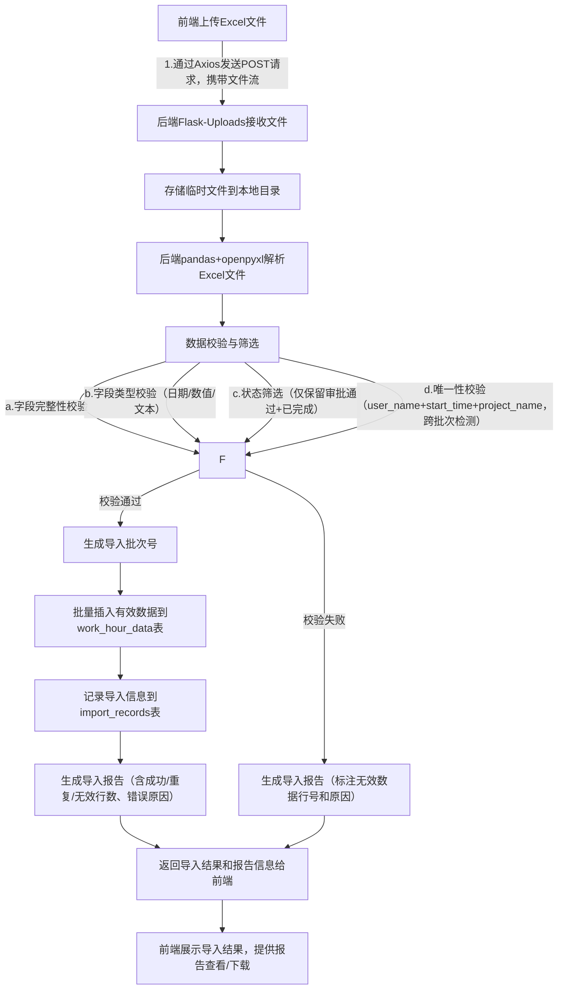
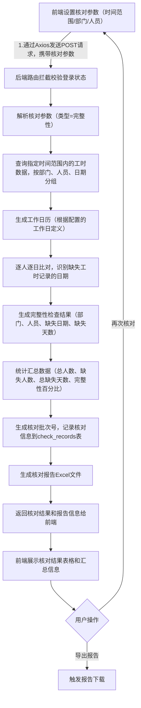
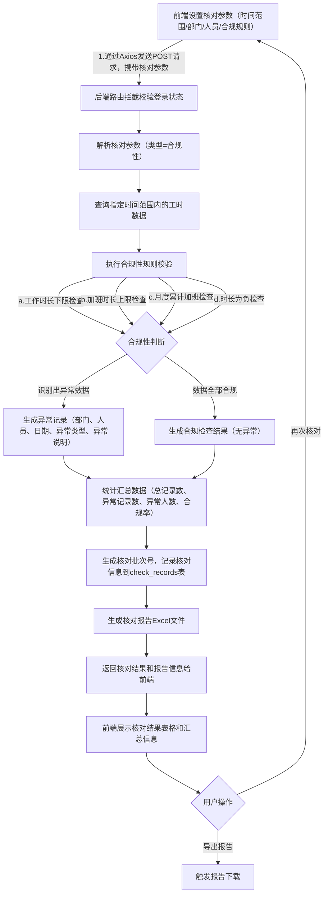

# 项目工时统计WEB软件概要架构设计说明书

## 一、基本信息

|字段名称|内容|
|---|---|
|文档版本|V1.1.0|
|文档作者|全栈软件开发工程师|
|创建日期|[当前日期]|
|适用范围|项目工时统计WEB软件的架构设计、技术选型指导、AI生成代码落地|
|关联文档|《项目工时统计WEB软件需求说明书（V1.1.0）》|

## 二、架构概述

### 2.1 架构设计目标

- 简单轻量：采用极简架构模式，减少不必要的中间件依赖，降低系统复杂度和部署成本。

- 适配AI生成：技术选型优先考虑社区成熟、文档丰富、AI支持度高的技术栈，确保后续AI生成代码可直接复用或少量调整即可落地。

- 高效稳定：满足核心业务（Excel导入、工时查询、工时核对）的性能需求，支持少量并发用户（≤50人）的稳定访问。

- 易维护性：架构分层清晰，模块职责明确，便于后续功能迭代和问题排查。

### 2.2 核心架构模式

采用"前后端分离+轻量服务端+文件存储"的极简架构模式，摒弃复杂的微服务、消息队列等组件，核心分为前端展示层、后端服务层、数据存储层三层，各层职责单一，通过简单接口交互。


说明：用户通过浏览器访问前端页面，前端通过RESTful API与后端交互；后端负责业务逻辑处理（Excel解析、数据校验、查询处理、工时核对等），并与数据库交互完成数据持久化；临时文件存储用于存放用户上传的Excel文件和导出的报告文件，处理完成后可自动清理或保留指定周期。

### 2.3 架构核心约束

- 技术栈约束：仅选用开源、轻量、AI友好的技术，不引入付费组件或复杂中间件。

- 部署约束：支持单机部署，无需分布式环境，降低部署和运维成本。

- 性能约束：满足页面加载≤2秒、Excel导入（1000行）≤30秒、查询响应≤5秒、工时核对（100人、90天范围）≤10秒的需求。

## 三、技术选型

### 3.1 前端技术选型

|技术类别|选型方案|选型理由|AI适配性|
|---|---|---|---|
|核心框架|Vue.js 3 + Vite|1. 轻量高效，学习成本低，社区生态成熟；2. Vue 3的Composition API便于模块化开发；3. Vite构建速度快，支持热更新，提升开发效率；4. 无需复杂的状态管理，用Pinia（轻量状态管理库）即可满足简单状态共享需求。|极高：AI对Vue 3语法、组件开发、API调用的生成支持成熟，可直接生成页面组件和交互逻辑。|
|UI组件库|Element Plus|1. 轻量、易用，组件丰富（表格、表单、上传、弹窗等核心组件全覆盖）；2. 与Vue 3完美适配，文档清晰；3. 支持按需引入，减少打包体积。|极高：AI可直接生成基于Element Plus的表格展示、文件上传、条件查询等常用功能代码。|
|HTTP请求|Axios|1. 轻量可靠，支持Promise，便于处理异步请求；2. 拦截器功能可轻松实现请求头添加、响应处理、错误捕获。|极高：AI可直接生成Axios的请求封装、API调用代码。|

### 3.2 后端技术选型

|技术类别|选型方案|选型理由|AI适配性|
|---|---|---|
|核心框架|Python + Flask|1. 轻量高效，学习成本低，开发速度快；2. Flask框架极简，无过多冗余功能，适合小型Web服务；3. Python生态丰富，Excel处理、数据校验等组件成熟；4. 社区文档完善，部署简单，支持单机快速落地。|极高：AI对Flask的路由配置、请求处理、数据库交互逻辑的生成支持完善，可直接生成核心业务接口代码。|
|Excel处理|pandas + openpyxl/xlsxwriter|1. pandas处理表格数据高效，支持复杂数据筛选和格式校验；2. openpyxl/xlsxwriter分别适配.xlsx文件的读取和写入，覆盖Excel全格式需求；3. 组合使用生态成熟，文档丰富，问题排查成本低。|极高：AI可生成基于pandas的Excel解析、数据校验、报告生成代码，适配各类Excel处理场景。|
|数据校验|pydantic|1. 轻量强大，语法简洁，支持类型注解式校验规则定义；2. 支持字段类型、必填项、取值范围、自定义校验等多种场景，完美匹配Excel导入数据的校验需求；3. 与Python生态适配性好，易于集成。|极高：AI可根据需求快速生成pydantic的数据模型和校验规则配置代码。|
|身份认证|PyJWT|1. 轻量无状态，无需存储会话信息，减少数据库压力；2. 生成和验证逻辑简单，与Flask框架集成便捷；3. 支持过期时间设置和签名加密，保障接口安全性。|极高：AI可直接生成PyJWT的签发、验证、请求拦截器配置代码。|

### 3.3 数据存储选型

|存储类别|选型方案|选型理由|AI适配性|
|---|---|---|---|
|关系型数据库|SQLite 3|1. 极简轻量，无需单独部署服务，以文件形式存储，单机部署无压力；2. 支持标准SQL语法，满足项目的结构化数据存储和查询需求；3. 零配置，开箱即用，适合小型应用；4. 支持事务，保障数据一致性。|极高：AI可直接生成SQLite的表结构创建语句、数据增删改查SQL语句。|
|临时文件存储|本地文件系统|1. 无需额外组件，直接使用服务器本地文件系统存储上传的Excel文件和导出的报告文件；2. 配置简单，可通过代码控制文件保留周期（如保留7天），定期自动清理，避免占用过多空间。|极高：AI可生成文件上传、存储路径配置、文件读写、自动清理的代码。|
说明：若后续用户量或数据量增长，可无缝迁移至MySQL（同属关系型数据库，SQL语法兼容），迁移成本极低；当前选型优先保障"简单轻量"和"AI生成适配性"。

## 四、核心模块划分与职责

### 4.1 前端模块划分

|模块名称|核心职责|核心技术/组件|
|---|---|---|
|登录模块|1. 用户名/密码输入与提交；2. 登录状态存储（localStorage）；3. 未登录拦截与跳转。|Vue 3、Element Plus（表单组件）、Axios、JWT|
|数据管理模块|1. Excel文件上传；2. 导入进度展示；3. 导入报告查看与下载；4. 导入记录查询；5. 按批次号查看导入数据详情。|Element Plus（上传组件、表格组件）、Axios|
|工时查询模块|1. 查询维度切换（项目/组织）；2. 筛选条件表单（项目名称、部门、时间范围等）；3. 查询结果表格展示；4. 结果汇总展示；5. 查询结果导出。|Element Plus（表格、表单、下拉框）、Axios|
|工时核对模块|1. 核对类型选择（完整性/合规性）；2. 核对参数设置（时间范围、部门、人员、合规规则）；3. 核对结果表格展示；4. 汇总统计展示；5. 核对报告导出；6. 核对历史记录查看。|Element Plus（表格、表单、下拉框）、Axios|
|系统设置模块|1. 数据备份（生成SQL文件下载）；2. 数据恢复（上传备份文件）；3. 基础配置查看（如文件保留周期、核对规则配置）。|Element Plus（按钮、上传组件）、Axios|
|公共组件模块|1. 全局导航栏；2. 页面布局容器；3. 消息提示（成功/失败/加载中）；4. 通用弹窗。|Vue 3、Element Plus（Layout、Message、Dialog）|

### 4.2 后端模块划分

|模块名称|核心职责|核心技术/组件|
|---|---|---|
|路由模块|1. 统一路由配置；2. 接口权限拦截（未登录校验）；3. 请求参数初步解析。|Flask、PyJWT、Flask-Router|
|用户认证模块|1. 用户名/密码校验；2. JWT签发与验证。|PyJWT、bcrypt（密码加密）、SQLite 3|
|Excel处理模块|1. 文件上传接收与存储；2. Excel文件解析（读取字段数据）；3. 数据校验（格式、字段、状态筛选、唯一性）；4. 导入报告生成；5. 有效数据入库。|Flask-Uploads、pandas、openpyxl、pydantic|
|工时查询模块|1. 接收查询条件（维度、筛选参数）；2. 生成查询SQL；3. 数据查询与汇总计算；4. 查询结果格式化；5. 导出文件生成。|SQLite 3、pandas、xlsxwriter|
|工时核对模块|1. 工时完整性检查（识别缺失工时的员工和日期）；2. 工时合规性检查（识别异常工时记录）；3. 核对报告生成；4. 核对结果记录入库。|SQLite 3、pandas、xlsxwriter|
|数据存储模块|1. 数据库连接管理；2. 数据增删改查封装；3. 事务控制；4. 数据备份与恢复。|SQLite 3、Flask-SQLAlchemy（ORM可选）|
|公共工具模块|1. 日期时间格式化；2. 错误处理与日志记录；3. 文件清理（定期删除临时文件）；4. 通用常量定义（如核对规则默认值）。|Python datetime、logging、os模块|

## 五、核心数据模型设计

基于SQLite设计核心数据表，表结构简洁，字段与需求说明书中的核心数据字段对应，确保数据存储完整且无冗余。

### 5.1 核心数据表：工时数据表（work_hour_data）

|字段名|字段类型|是否主键|是否非空|字段说明|关联需求字段|
|---|---|---|---|---|---|
|id|INTEGER|是|是|自增主键，唯一标识一条工时数据|-|
|serial_no|TEXT|否|否|钉钉OA审批记录序号|序号|
|user_name|TEXT|否|是|提交OA审批的人员姓名|姓名|
|start_time|DATETIME|否|是|工作开始时间|开始时间|
|end_time|DATETIME|否|是|工作结束时间|结束时间|
|project_manager|TEXT|否|否|项目经理姓名|项目交付-项目经理|
|project_name|TEXT|否|是|工作所属项目名称|项目交付-项目名称|
|work_hours|REAL|否|是|实际工作时长（小时），支持1位小数|项目交付-工作时长|
|overtime_hours|REAL|否|否|加班时长（小时），支持1位小数|项目交付-加班时长|
|work_content|TEXT|否|否|具体工作内容描述（最大500字符）|项目交付-工作内容|
|approval_result|TEXT|否|是|OA审批结果（仅存储"通过"）|审批结果|
|approval_status|TEXT|否|是|OA审批状态（仅存储"已完成"）|审批状态|
|dept_name|TEXT|否|是|提交OA审批人员所属部门|创建人部门|
|import_batch_no|TEXT|否|是|导入批次号，关联导入记录|-|
|import_time|DATETIME|否|是|数据导入系统的时间|-|

**索引设计**：
- `idx_start_time`：索引字段start_time，用于工时核对中按日期范围快速查询
- `idx_user_name`：索引字段user_name，用于工时核对中按员工查询
- `idx_dept_name`：索引字段dept_name，用于工时核对中按部门查询
- `idx_import_batch_no`：索引字段import_batch_no，用于关联查询导入记录

### 5.2 辅助数据表：导入记录表（import_records）

|字段名|字段类型|是否主键|是否非空|字段说明|
|---|---|---|---|---|
|id|INTEGER|是|是|自增主键|
|batch_no|TEXT|否|是|导入批次号（格式：IMP_年月日时分秒_随机数）|
|file_name|TEXT|否|是|上传的Excel文件名|
|total_rows|INTEGER|否|是|上传文件的总数据行数|
|success_rows|INTEGER|否|是|成功导入的有效数据行数|
|repeat_rows|INTEGER|否|是|重复数据行数|
|invalid_rows|INTEGER|否|是|无效数据行数（含状态不符、格式错误等）|
|import_user|TEXT|否|是|执行导入操作的用户名|
|import_time|DATETIME|否|是|导入时间|
|report_path|TEXT|否|否|导入报告文件的存储路径（若有）|
|error_details|TEXT|否|否|错误详情（JSON格式），存储所有无效数据的错误信息|
|duplicate_strategy|TEXT|否|是|重复数据处理策略（skip/cover）|
|file_size|INTEGER|否|否|导入文件大小（字节）|
|created_at|DATETIME|否|是|记录创建时间|

**error_details字段说明：**

- **数据格式**：JSON数组，包含所有无效数据的错误详情
- **存储内容**：
  ```json
  [
    {"row": 3, "field": "项目交付-项目名称", "error": "项目交付-项目名称字段为空"},
    {"row": 5, "field": "审批结果", "error": "审批结果为'--'，仅支持'通过'或'审批通过'"},
    {"row": 8, "field": "项目交付-工作时长", "error": "工作时长超过168小时（一周最大时长）"}
  ]
  ```
- **字段说明**：
  - `row`：Excel文件中的行号（包含表头，从2开始）
  - `field`：出错的字段名称
  - `error`：详细的错误原因描述
- **存储特点**：
  - 支持存储无限制数量的错误记录
  - 使用`json.dumps(errors, ensure_ascii=False)`序列化
  - 兼容Python字符串格式的旧数据（使用`ast.literal_eval`解析）
  - 历史记录可永久保存，方便随时查询和核对

### 5.3 辅助数据表：用户表（sys_users）

|字段名|字段类型|是否主键|是否非空|字段说明|
|---|---|---|---|---|
|id|INTEGER|是|是|自增主键|
|user_name|TEXT|否|是|登录用户名（唯一）|
|password|TEXT|否|是|加密后的密码（bcrypt加密）|
|real_name|TEXT|否|否|用户真实姓名|
|dept_name|TEXT|否|否|用户所属部门|
|create_time|DATETIME|否|是|用户创建时间|

### 5.4 辅助数据表：核对记录表（check_records）

|字段名|字段类型|是否主键|是否非空|字段说明|
|---|---|---|---|---|
|id|INTEGER|是|是|自增主键|
|check_no|TEXT|否|是|核对批次号（格式：CHK_年月日时分秒_随机数）|
|check_type|TEXT|否|是|核对类型（integrity-完整性/ compliance-合规性）|
|start_date|DATE|否|是|核对开始日期|
|end_date|DATE|否|是|核对结束日期|
|dept_name|TEXT|否|否|核对部门名称（null表示全部门）|
|user_name|TEXT|否|否|核对人员姓名（null表示全部门人员）|
|check_config|TEXT|否|否|核对规则配置（JSON格式，如工作日定义、合规阈值等）|
|check_result|TEXT|否|是|核对结果摘要（JSON格式，包含总人数、缺失人数、异常人数等统计信息）|
|report_path|TEXT|否|否|核对报告文件的存储路径（若有）|
|check_user|TEXT|否|是|执行核对操作的用户名|
|check_time|DATETIME|否|是|核对时间|

**核对配置（check_config）JSON结构示例**：

```json
{
  "workdays": [1, 2, 3, 4, 5],  // 周一到周五为工作日
  "standard_hours": 8,              // 每日标准工作时长
  "min_hours": 4,                  // 每日工作时长下限
  "max_overtime": 4,               // 每日加班时长上限
  "max_monthly_overtime": 80       // 每月加班时长上限
}
```

**核对结果（check_result）JSON结构示例**：

```json
{
  "integrity_check": {
    "total_users": 50,
    "missing_users": 3,
    "total_missing_days": 15,
    "integrity_rate": 99.5
  },
  "compliance_check": {
    "total_records": 1000,
    "invalid_records": 15,
    "invalid_users": 5,
    "compliance_rate": 98.5,
    "invalid_types": {
      "short_hours": 8,
      "excess_overtime": 5,
      "cumulative_excess": 2
    }
  }
}
```

**索引设计**：
- `idx_check_type`：索引字段check_type，用于按核对类型查询
- `idx_check_time`：索引字段check_time，用于查询历史核对记录
- `idx_dept_user`：索引字段dept_name + user_name，用于按部门和人员筛选

## 六、核心业务流程的技术实现

### 6.1 Excel数据导入流程实现



### 6.2 工时查询流程实现


### 6.3 工时完整性检查流程实现



### 6.4 工时合规性检查流程实现



## 七、部署与运维设计

### 7.1 部署架构

采用单机部署架构，无需分布式环境，部署步骤极简：

1. 准备一台服务器（Windows/Linux/macOS均可），安装Python环境（v3.9+）。

2. 将前端打包后的静态文件（dist目录）和后端代码部署到服务器指定目录。

3. 后端通过Gunicorn（轻量WSGI服务器）启动Flask服务，可搭配supervisor守护进程。

4. 前端静态文件可通过Nginx托管（推荐，提升静态资源访问速度），或通过Flask内置静态文件服务托管（简化部署）。

5. SQLite数据库文件自动生成在后端代码目录下，无需单独配置。

6. 配置系统定时任务（如cron），定期清理临时文件（如每天凌晨清理超过7天的文件）。

### 7.2 运维要点

- 临时文件清理：后端定时任务（如每天凌晨）清理本地临时目录中超过7天的Excel文件、导入报告、核对报告，避免占用过多磁盘空间。

- 数据备份：用户可通过系统"数据备份"功能手动导出SQLite数据库文件（.db），建议定期（如每周）备份并下载到本地。

- 日志管理：后端记录简单操作日志（登录、导入、查询、核对）和错误日志，存储在本地日志文件中，保留30天，便于问题排查。

- 版本更新：后续迭代时，直接覆盖后端代码和前端静态文件，SQLite数据库表结构变更可通过SQL脚本执行，无需复杂迁移工具。

- 核对规则维护：核对规则（如工作日定义、合规阈值）存储在配置文件或数据库配置表中，支持管理员通过系统界面调整，无需修改代码。

## 八、AI生成代码适配说明

### 8.1 代码生成优先级

1. 基础环境搭建：前端Vue 3+Vite项目初始化、后端Flask项目初始化、数据库表结构创建。

2. 核心业务模块：Excel导入模块、工时查询模块、工时核对模块、登录认证模块。

3. 辅助功能模块：导入记录查看、核对记录查看、查询结果导出、数据备份与恢复。

4. 公共工具模块：日志记录、临时文件清理、数据格式化。

### 8.2 AI生成代码的复用建议

- 前端组件：直接复用AI生成的Element Plus表格、表单、上传组件代码，仅需调整组件名称和接口地址。工时核对模块可复用工时查询模块的筛选表单和表格展示组件结构。

- 后端接口：复用AI生成的Flask路由、请求处理、数据库操作代码，重点核对数据校验规则、核对算法逻辑和SQL语句。

- 数据库操作：复用AI生成的SQL建表语句和CRUD代码，确保字段类型和约束与设计一致。工时核对涉及复杂的分组查询和日期范围查询，需AI重点关注SQL性能优化。

- 配置文件：AI生成的配置代码（如文件存储路径、JWT密钥、日志路径、核对规则默认值）需根据实际部署环境调整。

### 8.3 潜在问题与解决方法

- Excel解析兼容性：若AI生成的xlsx代码存在格式兼容问题，可补充指定Excel文件格式（.xls/.xlsx），让AI优化解析逻辑。

- 数据校验规则遗漏：若AI生成的校验代码未覆盖全部需求，可将需求中的校验规则逐条列出，让AI补充完善pydantic校验配置。

- SQL查询性能：若数据量较大时查询较慢（尤其是工时核对涉及大量数据扫描），可让AI生成索引创建语句（为start_time、user_name、dept_name等字段创建索引），并优化SQL查询语句。

- 工时核对算法准确性：若AI生成的核对算法存在问题（如工作日计算错误、缺失判断逻辑错误），可提供具体的测试场景和预期结果，让AI修正算法逻辑。

## 九、附录

### 9.1 技术栈版本建议

|技术类别|技术名称|建议版本|
|---|---|---|
|前端|Vue.js|3.3.x|
|前端|Vite|4.4.x|
|前端|Element Plus|2.4.x|
|前端|Axios|1.6.x|
|后端|Python|3.9.x 或 3.10.x|
|后端|Flask|2.3.x|
|后端|SQLite|3.41.x|
|后端|PyJWT|2.6.x|
|后端|pandas|2.0.x|
|后端|openpyxl|3.1.x|

### 9.2 核心依赖包清单

后端requirements.txt核心依赖：

```text
flask==2.3.3
flask-uploads==0.2.1
pandas==2.0.3
openpyxl==3.1.2
xlsxwriter==3.1.9
pydantic==2.4.2
pyjwt==2.6.0
bcrypt==4.0.1
flask-sqlalchemy==3.1.1
gunicorn==21.2.0
python-dotenv==1.0.0
pytest==7.4.3
```

前端package.json核心依赖：

```json
{
  "dependencies": {
    "vue": "^3.3.11",
    "pinia": "^2.1.7",
    "element-plus": "^2.4.4",
    "axios": "^1.6.2",
    "dayjs": "^1.11.10"
  },
  "devDependencies": {
    "@vitejs/plugin-vue": "^4.5.2",
    "vite": "^4.5.0"
  }
}
```

### 9.3 版本变更记录

|版本号|变更时间|变更内容|变更人|
|---|---|---|---|
|V1.0.0|2026-01-15|初始架构设计，包含Excel导入、工时查询、用户认证等核心功能|全栈软件开发工程师|
|V1.1.0|2026-01-15|新增工时核对模块设计，包括完整性检查和合规性检查；新增核对记录表（check_records）；更新核心业务流程图，增加工时核对流程；更新模块划分和职责；优化数据库索引设计|全栈软件开发工程师|
|V1.2.0|2026-01-15|新增导入数据查看功能设计，支持按批次号查看导入数据详情；更新数据管理模块职责|全栈软件开发工程师|

> （注：文档部分内容可能由 AI 生成）
