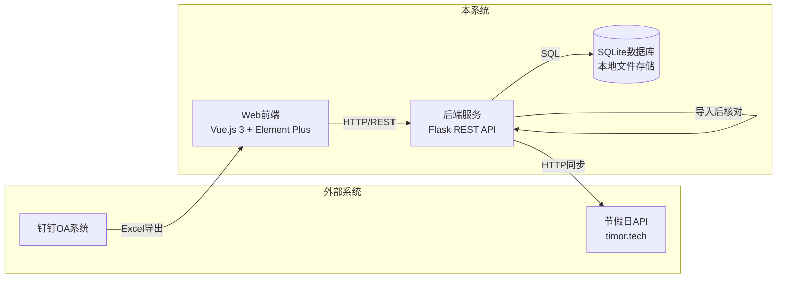
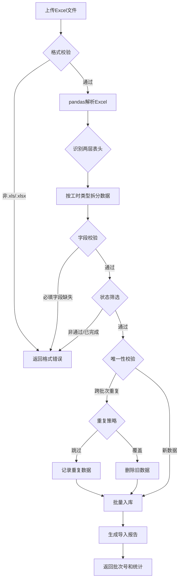
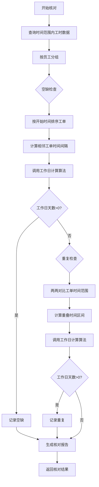
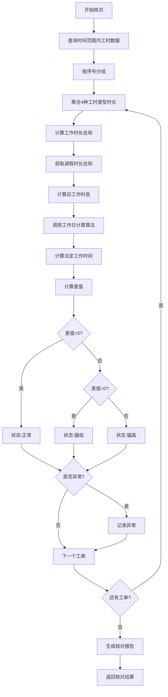
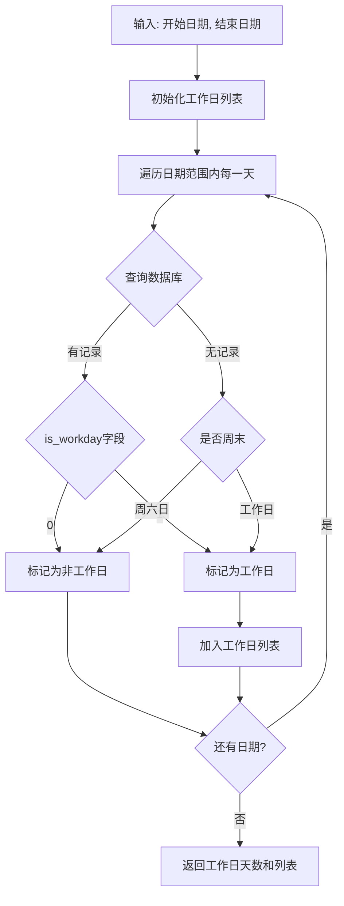
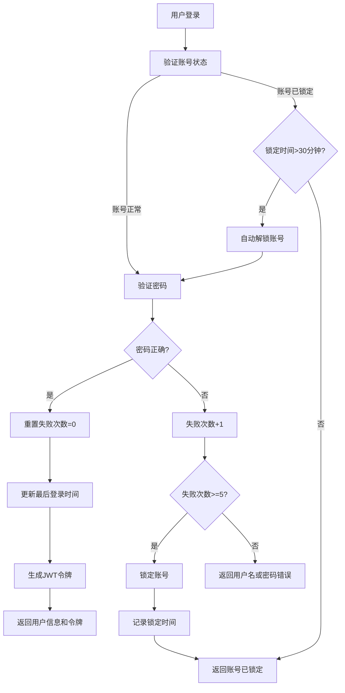

# 项目工时统计WEB软件概要设计说明书

## 第一章：概要设计

### 1.1 系统定位

本系统是一款面向企业项目管理的轻量级工时统计WEB应用，用于解决项目工时数据手工统计效率低、准确性差的问题。通过从钉钉OA审批系统导入Excel数据，实现工时数据的自动化校验、多维度查询和智能核对，为项目经理和部门负责人提供准确的工时投入分析。

**用户群体**：项目经理、部门负责人、行政/人事专员。

### 1.2 系统关系图



**数据流向说明**：
- **上游**：钉钉OA系统（Excel手动导出）、节假日API（自动同步法定节假日）
- **下游**：用户通过Web端查询统计结果、导出Excel报告
- **内部**：前端通过RESTful API调用后端服务，后端与SQLite数据库交互

### 1.3 模块划分

| 模块 | 核心职责 |
|------|---------|
| **数据管理** | Excel文件解析、数据校验、工时类型拆分、导入批次追踪 |
| **工时查询** | 项目/组织双维度查询、数据汇总、结果导出 |
| **工时核对** | 周报提交完整性检查、工作时长一致性检查、节假日管理 |
| **系统管理** | 用户认证授权、账号锁定保护、数据备份恢复、系统配置 |

### 1.4 技术栈

#### 1.4.1 前端技术栈

| 技术类别 | 技术选型 | 版本 | 用途说明 |
|---------|---------|------|---------|
| **核心框架** | Vue.js | 3.3.x | 渐进式JavaScript框架，构建单页应用 |
| **构建工具** | Vite | 4.5.x | 下一代前端构建工具，提供快速的开发服务器和热更新 |
| **UI组件库** | Element Plus | 2.4.x | 基于Vue 3的组件库，提供表格、表单、上传、弹窗等企业级组件 |
| **状态管理** | Pinia | 2.1.x | Vue 3官方推荐的状态管理库，管理用户登录状态 |
| **HTTP客户端** | Axios | 1.6.x | Promise based HTTP客户端，用于发送API请求 |
| **日期处理** | Day.js | 1.11.x | 轻量级日期处理库，用于日期格式化和计算 |
| **图标库** | @element-plus/icons-vue | 2.3.x | Element Plus官方图标库 |

#### 1.4.2 后端技术栈

| 技术类别 | 技术选型 | 版本 | 用途说明 |
|---------|---------|------|---------|
| **核心框架** | Python Flask | 2.3.x | 轻量级Python Web框架，提供RESTful API服务 |
| **数据库ORM** | Flask-SQLAlchemy | 3.1.x | SQLAlchemy的Flask集成，提供数据库ORM操作 |
| **Excel处理** | pandas | 2.0.x | 数据处理库，用于Excel文件解析和数据操作 |
| | openpyxl | 3.1.x | Excel文件读写库，支持.xlsx格式 |
| | xlsxwriter | 3.1.x | Excel文件生成库，用于导出报表 |
| **数据校验** | pydantic | 2.4.x | 数据验证库，使用类型注解进行数据校验 |
| **身份认证** | PyJWT | 2.6.x | JWT令牌生成和验证库 |
| **密码加密** | bcrypt | 4.0.x | 密码哈希加密库 |
| **CORS支持** | Flask-CORS | 4.0.x | 跨域资源共享支持 |
| **WSGI服务器** | Gunicorn | 21.2.x | 生产环境WSGI服务器 |

#### 1.4.3 数据存储技术栈

| 技术类别 | 技术选型 | 版本 | 用途说明 |
|---------|---------|------|---------|
| **数据库** | SQLite 3 | 3.41+ | 轻量级关系数据库，文件式存储，无需独立部署 |
| **数据备份** | SQLite内置 | - | 使用.backup命令或.dump命令进行数据备份 |

#### 1.4.4 开发工具

| 工具类型 | 工具选型 | 用途说明 |
|---------|---------|---------|
| **包管理器** | npm / pip | 前端使用npm管理依赖，后端使用pip管理依赖 |
| **代码规范** | ESLint / Pylint | 前端代码检查，后端代码规范检查 |
| **版本控制** | Git | 代码版本控制 |

---

## 第二章：详细设计

### 2.1 Excel数据导入

**背景**：钉钉导出的Excel采用两层表头结构，一个工单可能包含多种工时类型（项目交付、产研项目、售前支持、部门内务）和请假记录。系统需要将一条Excel记录拆分为多条数据库记录，并进行多级数据校验。

**流程说明**：



**关键设计决策**：
- **工时类型拆分**：Excel中一个工单包含4种工时类型，导入时按类型拆分为4条独立记录，便于按类型统计
- **状态筛选前置**：在数据拆分后立即筛选"审批通过+已完成"的记录，减少后续处理量
- **跨批次重复检测**：组合唯一标识为`序号+姓名+开始时间+工时类型+项目名称`，同批次允许重复（不同工作内容），跨批次判定重复

### 2.2 周报提交完整性检查

**背景**：员工可能忘记提交周报或重复提交，需要自动检测空缺和重复。难点在于如何正确计算影响的工作日天数（排除周末和法定节假日）。

**流程说明**：



**关键设计决策**：
- **空缺判定**：相邻工单之间存在时间间隔，且间隔期间的工作日天数>0即判定为空缺
- **重复判定**：两个工单的时间范围有交集，且交集期间的工作日天数>0即判定为重复
- **工作日计算**：优先使用数据库特殊标记（调休工作日/节假日），其次使用周末默认规则

### 2.3 工作时长一致性检查

**背景**：需要核对工单内的工作时长是否与法定工作时间一致。难点在于一个工单可能包含4种工时类型，需要按序号聚合后再计算，且不支持容差（必须完全一致）。

**流程说明**：



**关键设计决策**：
- **按序号聚合**：一个工单号对应多条工时记录，需按序号分组聚合4种工时类型的时长
- **无容差判定**：差值必须为0才算正常，不允许任何偏差（由业务规则决定）
- **应工作时長公式**：应工作时長 = 工作时长总和 + 请假时长总和（请假用于扣减法定工作时间）

### 2.4 工作日计算

**背景**：工时核对中多处需要计算工作日天数，需正确处理周末、法定节假日和调休工作日的复杂关系。

**流程说明**：



**关键设计决策**：
- **优先级规则**：数据库特殊标记（调休工作日/节假日）> 周末默认规则
- **数据库优先**：先查询holidays表，有记录则直接使用is_workday字段，无记录才使用周末判断
- **调休工作日**：春节调休周日上班时，数据库中is_workday=1，强制为工作日

### 2.5 用户认证与账号锁定

**背景**：系统需防止暴力破解攻击，连续登录失败后需要锁定账号。

**流程说明**：



**关键设计决策**：
- **自动解锁**：账号锁定30分钟后自动解锁，无需管理员手动干预
- **失败计数器**：每次成功登录后重置失败次数，确保锁定状态正确
- **JWT令牌**：有效期8小时，令牌过期后需重新登录

---

## 第三章：数据库 / 接口规范

### 3.1 数据库规范

```
SQLite（轻量级关系数据库）
├── 命名：表名 snake_case，如 work_hour_data、import_records
├── 必备字段：id INTEGER PK、created_at、updated_at
├── 字符集：UTF-8
├── 索引：高频查询字段必建索引（start_time、user_name、dept_name等）
├── JSON字段：error_details、repeat_details、check_config、check_result使用TEXT存储JSON字符串
└── 不存储大对象：Excel文件临时存储，处理完成后删除；导出文件生成后提供下载链接

数据类型映射
├── TEXT：字符串类型（姓名、项目名称、部门名称等）
├── INTEGER：整数类型（行数、数量、状态等）
├── REAL：浮点数类型（工时、时长，支持1位小数）
└── DATETIME/DATE：日期时间类型
```

### 3.2 接口规范

```
REST API
├── 风格：RESTful，统一前缀 /api/v1/
├── 响应结构：{ code, message, data, timestamp }
│   code: 200=成功，非0=业务错误
│   message: 操作结果描述
│   data: 业务数据（可选）
│   timestamp: 服务器时间戳
├── 分页：?page=1&size=20，响应带 total、totalPages
├── 时间格式：yyyy-MM-dd HH:mm:ss
└── 版本：Breaking change 升 v 号

文件上传
├── Content-Type: multipart/form-data
├── 文件大小限制：10MB
├── 文件格式限制：.xls、.xlsx
└── 响应：进度反馈或最终结果

文件下载
├── Content-Type: application/vnd.openxmlformats-officedocument.spreadsheetml.sheet
├── Content-Disposition: attachment; filename="xxx.xlsx"
└── 响应体：文件二进制流
```

---

## 第四章：安全 / 性能

### 4.1 安全

| 项目 | 措施 |
|------|------|
| 认证 | JWT（有效期8小时），密码使用bcrypt加密存储 |
| 账号保护 | 连续5次登录失败锁定账号30分钟，30分钟后自动解锁 |
| 数据校验 | 使用pydantic进行严格的数据格式校验，防止注入攻击 |
| 文件上传 | 校验文件格式（.xls/.xlsx）、大小（≤10MB），防止恶意文件上传 |
| SQL注入防护 | 使用参数化查询，所有用户输入必须经过校验和转义 |
| 操作审计 | 记录导入、核对等核心操作的执行人、时间和结果 |

### 4.2 性能

| 场景 | 措施 |
|------|------|
| Excel导入 | 1000行数据≤30秒，使用pandas高效解析，批量插入数据库 |
| 查询响应 | 单条件查询≤3秒，多条件查询≤5秒，为高频字段创建索引 |
| 工时核对 | 100人全量数据≤10秒，使用索引优化查询，避免全表扫描 |
| 分页查询 | 单页最大100条记录，防止一次性加载大量数据 |
| 文件清理 | 定期清理临时文件（uploads目录），保留7天 |

---

## 附录：版本说明

| 版本号 | 日期 | 说明 |
|--------|------|------|
| V1.0.0 | 2026-01-15 | 初始版本，包含核心功能 |

---

**文档编写日期**：2026-01-15
**软件版本**：V1.0
**文档作者**：软件开发团队
