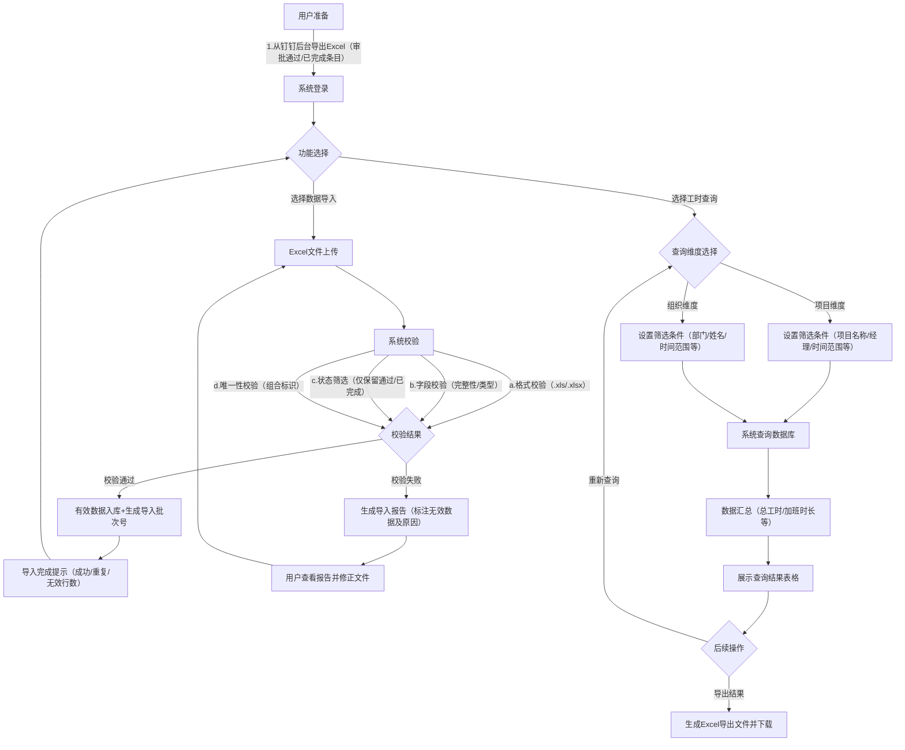
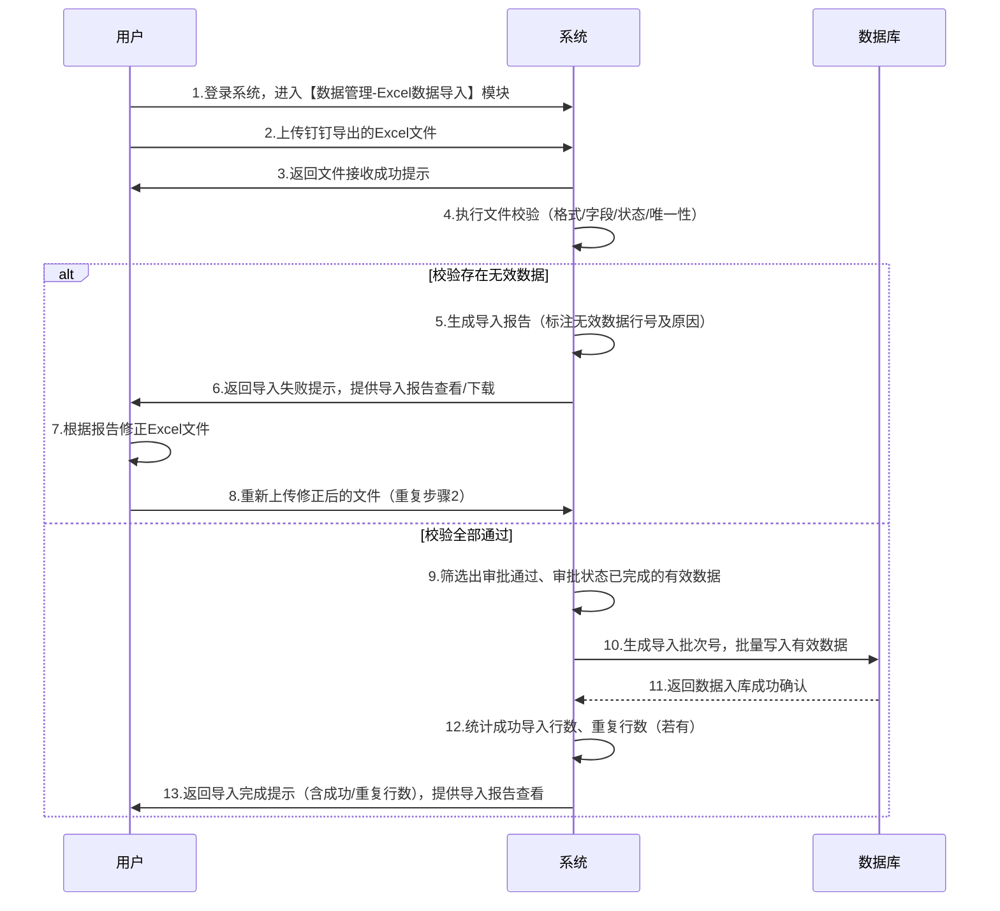

# 项目工时统计WEB软件需求说明书

## 一、基本信息

|字段名称|内容|
|---|---|
|文档版本|V1.0.0|
|文档作者|产品经理|
|创建日期|[当前日期]|
|适用范围|项目工时统计WEB软件的需求定义、开发指导、测试验收|
|关联角色|开发工程师、测试工程师、项目经理、部门负责人、系统使用者|
## 二、产品概述

### 2.1 项目背景

目前需对软件项目工时进行统计分析，数据来源为钉钉用户的OA审批记录。因费用限制，无法通过API接口直接对接钉钉后台数据，需用户从钉钉后台导出Excel文件后，上传至本系统完成数据录入与统计。为满足项目和组织维度的工时查询需求，特开发此轻量WEB软件，简化工时统计流程，提升数据查询效率。

### 2.2 产品目标

- 实现钉钉OA审批Excel数据的快速、准确导入，完成工时数据的批量录入。

- 支持按项目维度和组织维度查询工时数据，为项目管理和组织决策提供数据支撑。

- 系统设计简洁、易用，降低用户操作成本，无需专业技术背景即可上手使用。

### 2.3 用户画像

- 项目经理：需查询所负责项目的总工时、加班时长等数据，掌握项目人力投入情况。

- 部门负责人：需按组织（部门）维度查询工时数据，了解各部门人员的工作投入分布。

- 行政/人事专员：负责批量导入工时数据，保障数据录入的及时性和准确性。

### 2.4 范围边界

#### 2.4.1 包含范围

- 核心功能：Excel数据导入、项目维度工时查询、组织维度工时查询。

- 辅助功能：导入记录查看、查询结果导出（基础Excel格式）、数据校验提示。

#### 2.4.2 排除范围

- 不支持与钉钉后台的API接口实时对接。

- 不包含复杂的数据分析建模、可视化图表（如折线图、饼图等）功能。

- 不涉及用户权限的精细化管理（如角色权限细分、数据行级权限控制），仅支持基础的登录验证。

### 2.5 核心流程与时序说明

本节通过流程图和时序图直观呈现软件核心业务流程及功能交互逻辑，帮助相关用户快速理解软件设计与使用思路。

#### 2.5.1 核心业务流程图

该图展示软件核心业务（数据导入、工时查询）的完整流转逻辑，覆盖从数据准备到结果输出的全流程。

#### 2.5.2 核心功能时序图（Excel数据导入）

该图展示Excel数据导入功能中，用户与系统的交互时序及系统内部处理逻辑。

### 2.4 范围边界

#### 2.4.1 包含范围

- 核心功能：Excel数据导入、项目维度工时查询、组织维度工时查询。

- 辅助功能：导入记录查看、查询结果导出（基础Excel格式）、数据校验提示。

#### 2.4.2 排除范围

- 不支持与钉钉后台的API接口实时对接。

- 不包含复杂的数据分析建模、可视化图表（如折线图、饼图等）功能。

- 不涉及用户权限的精细化管理（如角色权限细分、数据行级权限控制），仅支持基础的登录验证。

## 三、功能清单

|一级菜单|二级菜单|功能描述|优先级|
|---|---|---|---|
|数据管理|Excel数据导入|支持上传.xls/.xlsx格式文件，完成格式、字段、唯一性校验，仅导入审批结果“通过”、审批状态“已完成”的有效数据，生成导入报告并存储数据|高|
||导入记录查看|展示历史导入批次信息（含导入批次号、导入时间、文件名、数据行数等），支持按时间范围筛选，可查看各批次详细导入报告|中|
|工时查询|项目维度查询|支持按项目名称、项目经理、时间范围等条件筛选，展示符合条件的工时数据，提供汇总统计和结果导出功能|高|
||组织维度查询|支持按部门名称、姓名、时间范围等条件筛选，展示符合条件的工时数据，提供汇总统计和结果导出功能|高|
||查询结果导出|将任意维度的工时查询结果导出为Excel文件，文件名按“工时查询结果_查询维度_查询时间”格式生成，包含当前展示的所有字段和数据|中|
|系统设置|数据备份与恢复|支持手动触发数据备份（导出SQL脚本），可通过备份文件进行数据恢复，恢复前需用户确认避免误操作|中|
||登录验证|提供用户名密码登录验证，密码加密存储，登录失败5次锁定账号30分钟，未登录用户无法访问系统任何功能模块|高|
## 四、功能需求

## 三、功能需求

### 3.1 核心功能一：Excel数据导入

#### 3.1.1 功能描述

支持用户上传从钉钉后台导出的工时相关Excel文件，系统对文件进行格式校验、字段校验和数据唯一性校验后，将有效数据批量录入系统数据库。

#### 3.1.2 触发条件

用户登录系统后，进入“数据导入”模块，点击“上传文件”按钮并完成文件选择与确认。

#### 3.1.3 输入要求

- 文件格式：仅支持Excel文件，包括.xls和.xlsx两种格式。

- 文件内容：需包含预设的15个字段，字段顺序可灵活调整，但字段名称需与系统预设字段完全一致（字段清单见本说明书4.1节）。

- 文件大小：单个文件大小不超过10MB，单次导入数据行数不超过1000行（满足轻量使用场景需求）。

#### 3.1.4 业务规则

- 

    - 数据筛选规则：系统仅导入并存储审批结果为“通过”、审批状态为“已完成”的条目，其他状态的条目直接判定为无效数据，不纳入系统存储和统计。

- 字段校验规则：

- 重复数据处理：以“序号+姓名+开始时间+项目交付-项目名称”作为组合唯一标识，若导入文件中存在重复数据，或导入数据与系统已存储数据重复，系统默认采用“跳过重复数据”策略，仅导入新增的有效数据；支持用户手动选择“覆盖重复数据”策略（覆盖系统中已存在的重复数据）。

- 出错机制：导入过程中若存在无效数据（如字段为空、格式错误、取值异常等），系统仅导入有效数据，同时生成导入报告，明确提示无效数据的行数、错误原因（如“第5行：开始时间格式错误”“第12行：项目交付-工作时长为非数值类型”），供用户查看和修正后重新导入。

- 其他规则：导入文件若存在空行、合并单元格、隐藏单元格，或数据位于非第一个Sheet页，对应行数据判定为无效数据；导入过程中用户刷新页面，系统需保障已导入的有效数据不丢失，导入完成后页面自动刷新展示最新数据。

#### 3.1.5 输出结果

- 导入成功提示：显示“导入完成”，并告知本次导入成功的有效数据行数、跳过/覆盖的重复数据行数、无效数据行数。

- 导入报告：支持用户点击“查看导入报告”，查看详细的无效数据信息；支持将导入报告导出为Excel文件。

- 数据存储：有效数据同步录入系统数据库，生成唯一的导入批次号，关联每条数据以便追溯。

### 3.2 核心功能二：工时查询（项目+组织维度）

#### 3.2.1 功能描述

支持用户分别按项目维度和组织维度查询工时数据，可设置多条件组合筛选，查询结果以表格形式展示，支持基础排序和导出。

#### 3.2.2 触发条件

用户登录系统后，进入“工时查询”模块，选择查询维度（项目/组织），设置筛选条件后点击“查询”按钮。

#### 3.2.3 查询维度与筛选条件

##### 3.2.3.1 项目维度查询

核心筛选条件：

- 项目名称：支持模糊查询，下拉选择框展示系统中已存储的所有项目名称（从导入数据的“项目交付-项目名称”字段提取）。

- 项目经理：支持模糊查询，下拉选择框展示系统中已存储的所有项目经理（从导入数据的“项目交付-项目经理”字段提取）。

- 时间范围：支持按“开始时间”或“结束时间”设置查询时间段（如“2026-01-01 至 2026-01-31”），时间范围不超过1年。

- 审批状态：默认查询“已完成”状态的数据，且仅能查询审批结果为“通过”的条目（系统仅存储此类有效数据）。

##### 3.2.3.2 组织维度查询

核心筛选条件：

- 部门名称：支持模糊查询，下拉选择框展示系统中已存储的所有部门（从导入数据的“创建人部门”字段提取）。

- 姓名：支持模糊查询，可查询指定部门下特定人员的工时数据。

- 时间范围：与项目维度查询的时间范围规则一致。

- 审批状态：默认查询“已完成”状态的数据，且仅能查询审批结果为“通过”的条目（系统仅存储此类有效数据）。

#### 3.2.4 业务规则

- 查询结果排序：默认按“开始时间”降序排列，支持用户手动选择按“项目交付-工作时长”“项目交付-加班时长”升序或降序排序。

- 汇总功能：支持按查询维度进行基础汇总，项目维度汇总显示所选项目的总工作时长、总加班时长、涉及人员数量；组织维度汇总显示所选部门的总工作时长、总加班时长、涉及项目数量。

- 数据展示规则：查询结果表格需完整展示15个核心字段，支持页面内分页（每页显示20/50/100行，用户可切换），支持横向滚动查看所有字段。

- 导出功能：支持将查询结果导出为Excel文件，导出文件包含当前页面展示的所有字段和数据，文件名默认格式为“工时查询结果_查询维度_查询时间”。

#### 3.2.5 输出结果

- 查询结果表格：展示符合筛选条件的所有工时数据，包含15个核心字段。

- 汇总信息：在查询结果表格上方展示汇总数据（总工作时长、总加班时长等）。

- 导出结果：生成符合要求的Excel导出文件，支持用户下载到本地。

### 3.3 辅助功能：导入记录查看

支持用户查看历史导入记录，包括导入批次号、导入时间、导入文件名、导入数据行数（成功/重复/无效）、导入人等信息；支持按导入时间范围筛选导入记录；支持点击查看某批次导入的详细报告（与该批次导入时生成的报告一致）。

## 五、数据需求

### 4.1 核心数据字段

系统核心数据来源于钉钉导出的Excel文件，包含以下15个字段，字段属性定义如下：

|字段名称|字段类型|是否必填|字段说明|取值约束|
|---|---|---|---|---|
|序号|文本|否|钉钉OA审批记录的序号|无|
|姓名|文本|是|提交OA审批的人员姓名|无|
|开始时间|日期时间|是|工作开始时间|支持格式：yyyy-MM-dd HH:mm:ss、yyyy-MM-dd|
|结束时间|日期时间|是|工作结束时间|支持格式：yyyy-MM-dd HH:mm:ss、yyyy-MM-dd；结束时间≥开始时间|
|项目交付-项目经理|文本|否|对应项目的项目经理姓名|无|
|项目交付-项目名称|文本|是|工作所属的项目名称|无|
|项目交付-工作时长|数值|是|实际工作时长，单位：小时|≥0，支持1位小数|
|项目交付-加班时长|数值|否|加班时长，单位：小时|≥0，支持1位小数；加班时长≤工作时长|
|项目交付-工作内容|文本|否|具体的工作内容描述|最大长度500字符|
|创建时间|日期时间|否|OA审批记录的创建时间|支持格式：yyyy-MM-dd HH:mm:ss、yyyy-MM-dd|
|当前负责人|文本|否|OA审批当前的处理负责人|无|
|审批结果|枚举|否|OA审批的最终结果|仅支持“通过”“拒绝”“待审批”|
|审批状态|枚举|否|OA审批的当前状态|仅支持“已完成”“处理中”“已撤销”|
|更新时间|日期时间|否|OA审批记录的最后更新时间|支持格式：yyyy-MM-dd HH:mm:ss、yyyy-MM-dd|
|创建人部门|文本|是|提交OA审批人员所属的部门|无|
### 4.2 数据存储要求

- 数据完整性：确保导入的有效数据完整存储，无字段丢失或数据篡改。

- 数据可追溯性：每条数据需关联导入批次号，便于追溯数据的导入来源和时间。

- 存储性能：支持至少10万条历史数据的存储，查询时响应时间≤3秒（单条件查询）、≤5秒（多条件组合查询）。

### 4.3 数据备份与恢复

系统支持手动触发数据备份功能，备份数据格式为SQL脚本文件，用户可下载备份文件至本地；支持通过备份文件进行数据恢复，恢复过程需提示用户确认，避免误操作覆盖现有数据。

## 六、非功能需求

### 5.1 性能需求

- 响应时间：页面加载时间≤2秒；Excel文件导入（1000行数据）时间≤30秒；查询响应时间≤3秒（单条件）、≤5秒（多条件）。

- 并发能力：支持同时在线用户数≤50人，同时导入文件的用户数≤5人，无明显性能下降（如页面卡顿、导入失败）。

### 5.2 易用性需求

- 操作流程简洁：核心功能（导入、查询）的操作步骤≤3步，用户无需培训即可完成基础操作。

- 提示信息清晰：所有操作结果（成功/失败）、错误原因、必填项提示均需以简洁易懂的文字展示，避免专业术语堆砌。

- 界面一致性：页面布局、按钮样式、交互逻辑保持一致，降低用户认知成本。

### 5.3 兼容性需求

支持主流浏览器：Chrome（版本≥80）、Edge（版本≥80）、Firefox（版本≥75）、Safari（版本≥14）；支持Windows 10及以上、macOS 10.15及以上操作系统。

### 5.4 安全性需求

- 登录验证：系统需提供登录功能，用户凭用户名和密码登录，密码采用加密存储（如MD5加密），登录失败次数≥5次时，锁定账号30分钟。

- 数据安全：导入的Excel文件和系统存储的工时数据需进行加密处理，防止数据泄露；禁止未登录用户访问系统任何功能模块。

- 防恶意操作：系统需过滤恶意文件上传（如非Excel格式的可执行文件），避免病毒注入或系统攻击。

### 5.5 可维护性需求

系统代码需保留清晰的注释，数据库表结构设计合理并提供说明文档；支持对系统配置参数（如最大导入文件大小、并发用户数限制）进行简单修改，无需大量代码调整。

## 七、约束条件

- 技术约束：因费用限制，无法使用付费的云服务、第三方组件或API接口，需基于开源技术栈开发。

- 数据来源约束：仅支持钉钉OA审批导出的Excel文件导入，不支持其他来源（如手动录入、其他系统导出文件）的数据录入。

- 硬件环境约束：无特殊硬件要求，用户可通过普通办公电脑（CPU≥i3、内存≥4GB）访问系统。

## 八、验收标准

### 7.1 功能验收标准

#### 7.1.1 Excel数据导入功能

- 正常场景：上传符合要求的Excel文件（1000行有效数据，均为审批结果“通过”、审批状态“已完成”），系统成功导入所有数据，导入报告显示“成功1000行，重复0行，无效0行”，数据存储完整且可通过查询功能检索到。

- 异常场景1：上传包含5行无效数据（2行姓名为空、3行工作时长为负数，另含2行审批结果“拒绝”条目）的Excel文件，系统仅导入符合条件的有效数据，导入报告准确列出7行无效数据的行数和错误原因（含2行审批状态不符），无效数据未存入数据库。

- 异常场景2：上传非Excel格式文件（如.txt、.pdf），系统提示“文件格式错误，请上传.xls或.xlsx格式文件”，未执行导入操作。

- 重复数据场景：上传包含10行重复数据（与系统已存储数据重复）的Excel文件，选择“跳过重复数据”策略，系统导入新增的有效数据，导入报告显示“重复10行，跳过处理”。

#### 7.1.2 工时查询功能

- 项目维度查询：选择项目名称“XX系统开发”、时间范围“2026-01-01至2026-01-31”，查询结果准确展示该项目在指定时间段内的所有工时数据，汇总信息显示正确的总工作时长和总加班时长，支持按工作时长降序排序。

- 组织维度查询：选择部门“技术部”、姓名“张三”，查询结果准确展示张三在技术部期间的所有工时数据，导出功能可生成包含所有查询结果的Excel文件，文件格式正确、数据完整。

- 多条件组合查询：选择部门“产品部”、时间范围“2026-01-01至2026-01-31”、审批状态“已完成”，查询结果仅包含符合所有筛选条件的数据，无遗漏或多余数据。

### 7.2 非功能验收标准

- 性能：页面加载时间≤2秒；1000行数据导入时间≤30秒；多条件查询（5000条结果）响应时间≤5秒。

- 兼容性：在Chrome、Edge、Firefox、Safari四种浏览器中，所有功能均能正常使用，页面布局无错乱。

- 安全性：未登录用户访问系统任意页面，自动跳转至登录页；密码加密存储，登录失败5次后账号锁定30分钟；上传恶意文件被拦截，系统无异常。

## 九、附录

### 8.1 术语表

|术语|定义|
|---|---|
|项目维度查询|以项目为核心筛选条件，查询该项目相关的所有工时数据及汇总信息|
|组织维度查询|以部门（组织）为核心筛选条件，查询该部门相关的所有工时数据及汇总信息|
|导入批次号|系统为每次Excel导入操作生成的唯一标识，格式为“IMP_年月日时分秒_随机数”（如IMP_20260109153025_1234）|
|有效数据|符合系统字段校验规则、无重复的导入数据|
### 8.2 参考资料

- 《钉钉OA审批数据导出规范》

- 《WEB系统Excel导入功能设计指南》

### 8.3 版本变更记录

|版本号|变更时间|变更内容|变更人|
|---|---|---|---|
|V1.0.0|[当前日期]|首次完成需求说明书撰写，覆盖核心功能、数据需求、非功能需求等全维度内容|产品经理|
> （注：文档部分内容可能由 AI 生成）