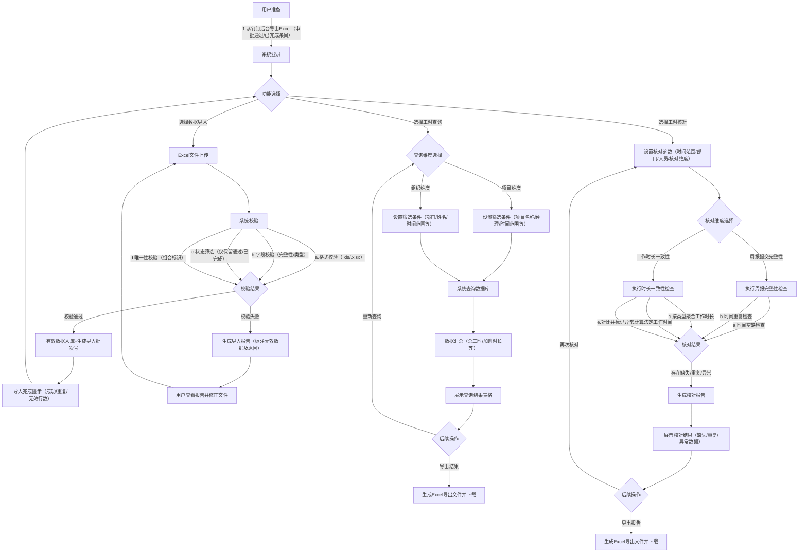
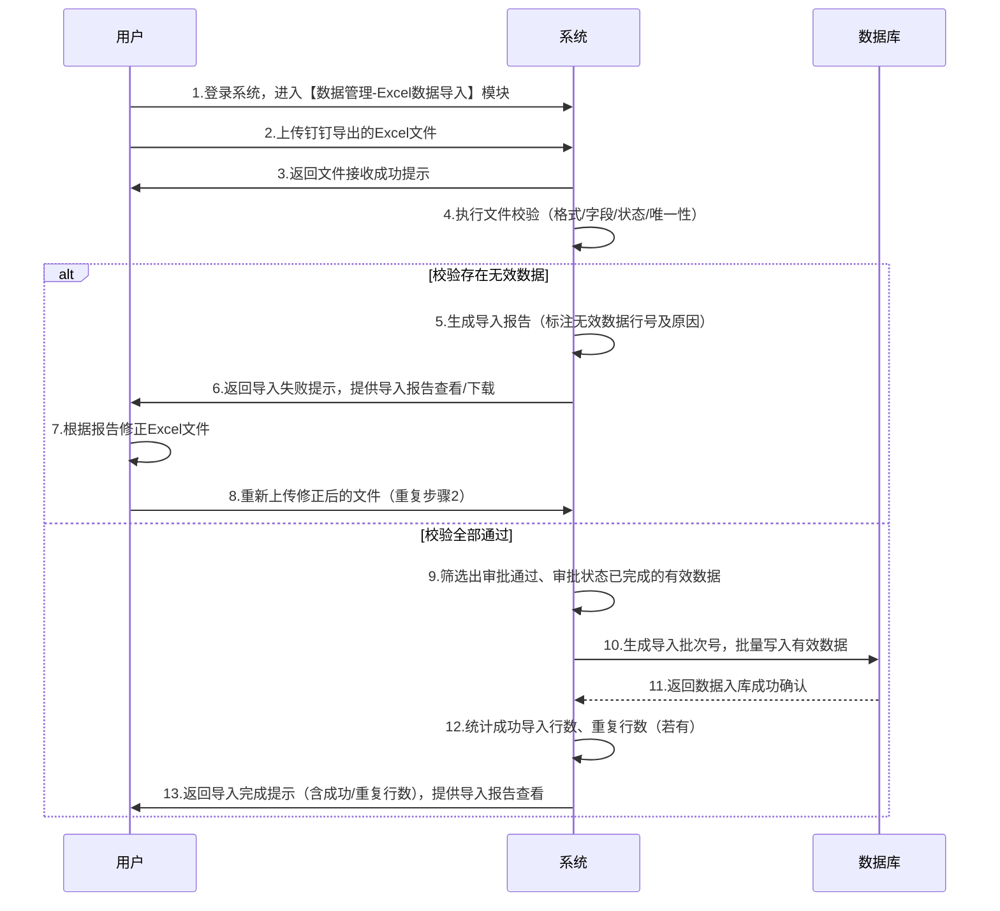
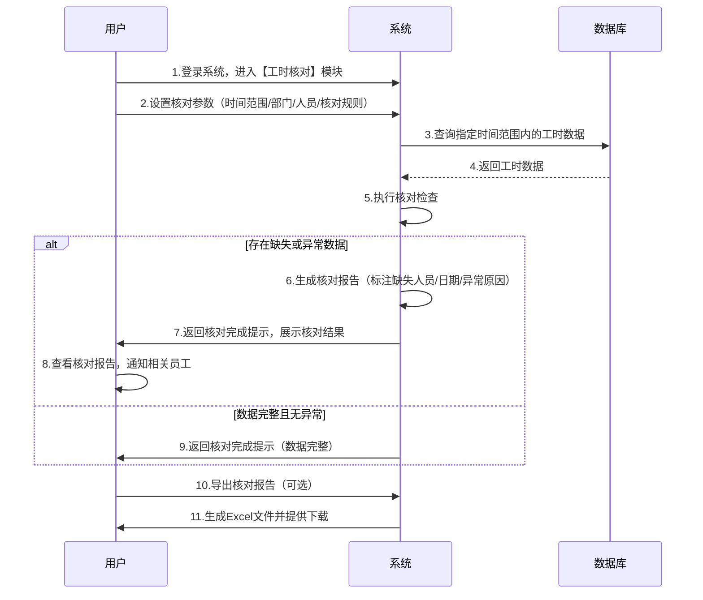

# 项目工时统计WEB软件需求说明书

## 一、基本信息

|字段名称|内容|
|---|---|
|文档版本|V1.2.0|
|文档作者|产品经理|
|创建日期|[当前日期]|
|适用范围|项目工时统计WEB软件的需求定义、开发指导、测试验收|
|关联角色|开发工程师、测试工程师、项目经理、部门负责人、系统使用者|

## 二、产品概述

### 2.1 项目背景

目前需对软件项目工时进行统计分析，数据来源为钉钉用户的OA审批记录。因费用限制，无法通过API接口直接对接钉钉后台数据，需用户从钉钉后台导出Excel文件后，上传至本系统完成数据录入与统计。为满足项目和组织维度的工时查询需求，特开发此轻量WEB软件，简化工时统计流程，提升数据查询效率。

随着项目推进，发现单纯的数据统计无法保证工时数据的准确性和完整性。员工可能忘记提交工时记录或提交不完整，导致项目工时统计结果失真，影响项目管理和决策。因此需要在数据统计之前增加工时核对功能，及时发现并提醒员工补充缺失的工时记录。

### 2.2 产品目标

- 实现钉钉OA审批Excel数据的快速、准确导入，完成工时数据的批量录入。

- 支持按项目维度和组织维度查询工时数据，为项目管理和组织决策提供数据支撑。

- 提供工时核对功能，自动检查员工工时提交的完整性和合规性，及时发现并提醒缺失或异常的工时记录，确保项目工时统计准确可靠。

- 系统设计简洁、易用，降低用户操作成本，无需专业技术背景即可上手使用。

### 2.3 用户画像

- **项目经理**：需查询所负责项目的总工时、加班时长等数据，掌握项目人力投入情况，关注项目成员的工时提交情况，确保项目工时数据完整准确。

- **部门负责人**：需按组织（部门）维度查询工时数据，了解各部门人员的工作投入分布，监督部门员工的工时提交完整性和合规性。

- **行政/人事专员**：负责批量导入工时数据，执行工时核对检查，生成核对报告并通知相关员工补充缺失的工时记录。

#### 2.3.1 用户与员工概念区分

为明确系统中的角色和数据管理，特区分以下两个概念：

**用户（User）**：
- **定义**：可以登录系统的账号，用于身份认证和权限管理
- **数据来源**：sys_users 表
- **包含信息**：用户名、密码、角色（admin/user）、邮箱、状态等
- **管理位置**：系统管理 → 用户管理
- **维护人员**：系统管理员
- **用途**：系统登录、权限控制、操作审计

**员工（Employee）**：
- **定义**：仅包含姓名和部门信息的数据，用于 Excel 导入时补充缺失的部门字段
- **数据来源**：employees 表
- **包含信息**：员工姓名、部门名称
- **管理位置**：数据管理 → 员工管理
- **维护人员**：数据管理员
- **用途**：数据导入时的部门信息补充

**关系说明**：
- 用户和员工是两个独立的概念
- 一个用户账号可以对应多个员工记录（无直接关联）
- 员工数据是辅助数据，用户账号是认证数据
- 两者在系统中独立维护，各司其职

### 2.4 范围边界

#### 2.4.1 包含范围

- **核心功能**：Excel数据导入、项目维度工时查询、组织维度工时查询、工时核对。

- **辅助功能**：导入记录查看、查询结果导出（基础Excel格式）、数据校验提示、核对历史查看。

#### 2.4.2 排除范围

- 不支持与钉钉后台的API接口实时对接。

- 不包含复杂的数据分析建模、可视化图表（如折线图、饼图等）功能。

- 不涉及用户权限的精细化管理（如角色权限细分、数据行级权限控制），仅支持基础的登录验证。

- 不支持实时消息通知功能，仅支持系统内报告查看和导出。

### 2.5 核心流程与时序说明

本节通过流程图和时序图直观呈现软件核心业务流程及功能交互逻辑，帮助相关用户快速理解软件设计与使用思路。

#### 2.5.1 核心业务流程图

该图展示软件核心业务（数据导入、工时查询、工时核对）的完整流转逻辑，覆盖从数据准备到结果输出的全流程。



#### 2.5.2 核心功能时序图（Excel数据导入）

该图展示Excel数据导入功能中，用户与系统的交互时序及系统内部处理逻辑。



#### 2.5.3 核心功能时序图（工时核对）

该图展示工时核对功能中，用户与系统的交互时序及系统内部处理逻辑。



## 三、功能清单

|一级菜单|二级菜单|功能描述|优先级|
|---|---|---|---|
|数据管理|Excel数据导入|支持上传.xls/.xlsx格式文件，完成格式、字段、唯一性校验，仅导入审批结果"通过"、审批状态"已完成"的有效数据，生成导入报告并存储数据|高|
||导入记录查看|展示历史导入批次信息（含导入批次号、导入时间、文件名、数据行数等），支持按时间范围筛选，可查看各批次详细导入报告|中|
||导入数据查看|按导入批次号查看该批次成功导入的工时数据详情，支持分页展示和数据导出，用于核对导入数据是否正常存入系统|中|
|工时查询|项目维度查询|支持按项目名称、项目经理、时间范围等条件筛选，展示符合条件的工时数据，提供汇总统计和结果导出功能|高|
||组织维度查询|支持按部门名称、姓名、时间范围等条件筛选，展示符合条件的工时数据，提供汇总统计和结果导出功能|高|
||查询结果导出|将任意维度的工时查询结果导出为Excel文件，文件名按"工时查询结果_查询维度_查询时间"格式生成，包含当前展示的所有字段和数据|中|
|工时核对|周报提交完整性检查|检查员工是否每周按时提交工时周报，识别时间空缺（漏报）和时间重复（重复提交），自动排除周末和法定节假日|高|
||工作时长一致性检查|核对周报内的工作时长（按4种类型统计）+ 请假时长是否与法定工作时间一致，识别时长异常数据|高|
||核对历史查看|查看历史核对记录（包含触发方式、核对类型、核对参数、核对结果摘要），支持查看详细报告|中|
|系统设置|数据备份与恢复|支持手动触发数据备份（导出SQL脚本），可通过备份文件进行数据恢复，恢复前需用户确认避免误操作|中|

## 四、功能需求

### 3.1 核心功能一：Excel数据导入

#### 3.1.1 功能描述

支持用户上传从钉钉后台导出的工时相关Excel文件，系统对文件进行格式校验、字段校验和数据唯一性校验后，将有效数据批量录入系统数据库。

#### 3.1.2 触发条件

用户登录系统后，进入"数据导入"模块，点击"上传文件"按钮并完成文件选择与确认。

#### 3.1.3 输入要求

- 文件格式：仅支持Excel文件，包括.xls和.xlsx两种格式。
- 文件内容：需包含预设的15个字段，字段顺序可灵活调整，但字段名称需与系统预设字段完全一致（字段清单见本说明书4.1节）。
- 文件大小：单个文件大小不超过10MB，单次导入数据行数不超过1000行（满足轻量使用场景需求）。

#### 3.1.4 业务规则

- 数据筛选规则：系统仅导入并存储审批结果为"通过"、审批状态为"已完成"的条目，其他状态的条目直接判定为无效数据，不纳入系统存储和统计。

- 重复数据处理：以"姓名+开始日期+项目交付-项目名称"作为组合唯一标识；**同批次内**允许同一人同一日期同一项目提交多条工时记录（可能是不同工作内容）；**跨批次**时，与系统已存储数据重复的，系统默认采用"跳过重复数据"策略，仅导入新增的有效数据；支持用户手动选择"覆盖重复数据"策略（覆盖系统中已存在的重复数据）。

- 出错机制：导入过程中若存在无效数据（如字段为空、格式错误、取值异常等），系统仅导入有效数据，同时生成导入报告，明确提示无效数据的行数、错误原因（如"第5行：开始日期格式错误""第12行：项目交付-工作时长为非数值类型"），供用户查看和修正后重新导入。

- 其他规则：导入文件若存在空行、合并单元格、隐藏单元格，或数据位于非第一个Sheet页，对应行数据判定为无效数据；导入过程中用户刷新页面，系统需保障已导入的有效数据不丢失，导入完成后页面自动刷新展示最新数据。

**部门字段处理逻辑**：

在 Excel 数据导入过程中，系统对"创建人部门"字段采用三级降级策略，确保数据的完整性和准确性：

1. **优先级 1：Excel 字段**
   - 系统首先读取 Excel 文件中"创建人部门"字段的值
   - 如果该字段有值且同一序号的所有行部门值一致，直接使用该值
   - 验证规则：同一序号（工单号）的多行数据中，"创建人部门"字段必须保持一致，否则报错

2. **优先级 2：员工表自动补充**
   - 如果 Excel 中"创建人部门"字段为空，系统自动从 employees 表查询
   - 根据员工姓名（姓名字段）匹配对应的部门信息
   - 如果匹配成功，自动补充部门信息
   - 查询使用批量查询优化，性能优异（1000 用户 < 100ms）

3. **优先级 3：报错提示**
   - 如果 Excel 中部门为空，且 employees 表中也未找到该员工的部门信息
   - 系统报错并提示用户前往"数据管理 → 员工管理"配置该员工的部门
   - 错误信息会明确指出哪些员工需要配置，提供具体的员工姓名和行号信息

**验证规则**：
- 员工姓名必须与 Excel 文件中的"姓名"字段完全一致（精确匹配）
- 部门信息不能为空（必须通过上述三种方式之一获取）
- 同一序号的多行数据必须使用相同的部门值

**配置方式**：
数据管理员可以在"数据管理 → 员工管理"页面手动维护员工的姓名和部门对应关系，确保 Excel 导入时能自动补充缺失的部门信息。

#### 3.1.5 输出结果

- 导入成功提示：显示"导入完成"，并告知本次导入成功的有效数据行数、跳过/覆盖的重复数据行数、无效数据行数。
- 导入报告：支持用户点击"查看导入报告"，查看详细的无效数据信息；支持将导入报告导出为Excel文件。
- 数据存储：有效数据同步录入系统数据库，生成唯一的导入批次号，关联每条数据以便追溯。

### 3.2 核心功能二：工时查询（项目+组织维度）

#### 3.2.1 功能描述

支持用户分别按项目维度和组织维度查询工时数据，可设置多条件组合筛选，查询结果以表格形式展示，支持基础排序和导出。

#### 3.2.2 触发条件

用户登录系统后，进入"工时查询"模块，选择查询维度（项目/组织），设置筛选条件后点击"查询"按钮。

#### 3.2.3 查询维度与筛选条件

##### 3.2.3.1 项目维度查询

核心筛选条件：

- 项目名称：支持模糊查询，下拉选择框展示系统中已存储的所有项目名称（从导入数据的"项目交付-项目名称"字段提取）。
- 项目经理：支持模糊查询，下拉选择框展示系统中已存储的所有项目经理（从导入数据的"项目交付-项目经理"字段提取）。
- 时间范围：支持按"开始时间"或"结束时间"设置查询时间段（如"2026-01-01 至 2026-01-31"），时间范围不超过1年。
- 审批状态：默认查询"已完成"状态的数据，且仅能查询审批结果为"通过"的条目（系统仅存储此类有效数据）。

##### 3.2.3.2 组织维度查询

核心筛选条件：

- 部门名称：支持模糊查询，下拉选择框展示系统中已存储的所有部门（从导入数据的"创建人部门"字段提取）。
- 姓名：支持模糊查询，可查询指定部门下特定人员的工时数据。
- 时间范围：与项目维度查询的时间范围规则一致。
- 审批状态：默认查询"已完成"状态的数据，且仅能查询审批结果为"通过"的条目（系统仅存储此类有效数据）。

#### 3.2.4 业务规则

- 查询结果排序：默认按"开始时间"降序排列，支持用户手动选择按"项目交付-工作时长""项目交付-加班时长"升序或降序排序。

- 汇总功能：支持按查询维度进行基础汇总，项目维度汇总显示所选项目的总工作时长、总加班时长、涉及人员数量；组织维度汇总显示所选部门的总工作时长、总加班时长、涉及项目数量。

- 数据展示规则：查询结果表格需完整展示15个核心字段，支持页面内分页（每页显示20/50/100行，用户可切换），支持横向滚动查看所有字段。

- 导出功能：支持将查询结果导出为Excel文件，导出文件包含当前页面展示的所有字段和数据，文件名默认格式为"工时查询结果_查询维度_查询时间"。

#### 3.2.5 输出结果

- 查询结果表格：展示符合筛选条件的所有工时数据，包含15个核心字段。
- 汇总信息：在查询结果表格上方展示汇总数据（总工作时长、总加班时长等）。
- 导出结果：生成符合要求的Excel导出文件，支持用户下载到本地。

### 3.3 核心功能三：工时核对

#### 3.3.1 功能概述

工时核对功能用于检查员工工时提交的完整性和一致性，及时发现缺失或异常的工时记录，确保项目工时统计准确可靠。

该功能包含**两个核心核对维度**：

| 核对维度 | 核对目标 | 核对内容 |
|---------|---------|---------|
| **周报提交完整性** | 员工是否每周按时提交工时周报 | 时间空缺检查（漏报）、时间重复检查（重复提交） |
| **工作时长一致性** | 周报内的工作时长是否与法定工作时间一致 | 按类型统计工作时长 + 请假时长，对比法定工作时间 |

**Excel数据结构说明**：

钉钉导出的Excel文件采用**两层表头**设计，一个序号（一个工单）可能包含多种工时类型：

| 工时类型 | Excel大类 | 工作时长字段 | 说明 |
|---------|----------|------------|------|
| **项目交付** | 【项目交付工时】 | 项目交付-工作时长 | 外部项目交付工时 |
| **产研项目** | 【产研项目工时】 | 产品-工作时长 | 内部产品研发工时 |
| **售前支持** | 【售前支持工时】 | 售前-工作时长 | 售前支持活动工时 |
| **部门内务** | 【部门内务工时】 | 部门-工作时长 | 部门内部管理工时 |
| **请假记录** | 【请假记录】 | 请假时长 | 请假时长（单独统计） |

**数据拆分规则**：

系统导入时，将一条Excel记录拆分为多条数据库记录（每条记录对应一种工时类型），以便按类型统计工作时长。

---

#### 3.3.2 核对维度一：周报提交完整性

##### 3.3.2.1 功能描述

检查员工在指定时间范围内是否每周按时提交工时周报，识别时间空缺（漏报）和时间重复（重复提交）。

**核心特点**：
- 自动排除周末（周六、周日）
- 自动排除法定节假日
- 按工作日天数计算空缺和重复

##### 3.3.2.2 触发条件

用户登录系统后，进入"工时核对"模块，选择"周报提交完整性"，设置核对参数后点击"开始核对"按钮。

##### 3.3.2.3 输入要求

- **时间范围**：支持设置核对的时间段（如"2026-01-01 至 2026-12-31"），无时间限制。
- **部门选择**：可选，支持选择特定部门进行核对，不选择则核对所有部门。
- **人员选择**：可选，支持选择特定人员（姓名）进行核对，不选择则核对部门内所有人员。

##### 3.3.2.4 业务规则

**1. 空缺检查**

检查员工在某个时间段内未提交周报的情况。

- **判定逻辑**：检查相邻工单之间是否存在时间空隙（前一个结束时间 < 后一个开始时间）
- **空缺天数计算**：计算空缺期间的工作日天数（排除周末和法定节假日）
- **空缺判定**：如果扣除周末和节假日后，剩余工作日天数 > 0，判定为空缺
- **允许情况**：完全在法定节假日或周末内的空缺不算漏报

**示例**：
```
工单A：2026-01-01 至 2026-01-07
工单B：2026-01-15 至 2026-01-21
空缺期间：2026-01-08 至 2026-01-14（共7天）
扣除周末：01-10（周六）、01-11（周日）= 剩余5天
扣除节假日：01-08（元旦假期）= 剩余4天
结论：空缺工作日4天，判定为漏报
```

**2. 重复检查**

检查员工提交了时间范围重叠的周报的情况。

- **判定逻辑**：同一员工的工单两两对比，检查时间范围是否有交集
- **重复条件**：两个工单的时间范围有交集即判定为重复
- **重复天数计算**：计算重叠期间的工作日天数（排除周末和法定节假日）
- **允许情况**：重叠期间完全在法定节假日或周末内不算重复

**示例**：
```
工单A：2026-01-01 至 2026-01-10
工单B：2026-01-08 至 2026-01-15
重复期间：2026-01-08 至 2026-01-10（共3天）
扣除节假日：01-08（元旦假期）= 剩余2天
扣除周末：01-10（周六）= 剩余1天
结论：重复工作日1天，判定为重复提交
```

##### 3.3.2.5 输出结果

**核对结果表格**：

| 员工姓名 | 部门 | 问题类型 | 工单序号 | 时间范围 | 说明 | 影响工作日天数 |
|---------|------|---------|---------|---------|------|--------------|
| 张三 | 技术部 | 空缺 | - | 2026-01-08 至 2026-01-14 | 未提交周报 | 4天 |
| 李四 | 产品部 | 重复 | 005, 006 | 2026-01-01 至 2026-01-10 | 与序号006时间重叠 | 1天 |

**汇总统计**：
- 核对总人数
- 存在空缺人数、总空缺工作日天数
- 存在重复人数、总重复工作日天数
- 完整性百分比 = (1 - 空缺工作日天数 / 应提交工作日天数) × 100%

---

#### 3.3.3 核对维度二：工作时长一致性

##### 3.3.3.1 功能描述

核对一个工单（同一个序号）内的工作时长总和 + 请假时长，是否与该工单时间范围内的法定工作时间一致，按工时类型分别统计。

**核心特点**：
- 按4种工时类型分别统计工作时长（项目交付、产研项目、售前支持、部门内务）
- 加班时长不计入工作时长总和
- 请假时长用于扣减法定工作时间
- 不支持容差，必须完全一致才算正常

##### 3.3.3.2 触发条件

用户登录系统后，进入"工时核对"模块，选择"工作时长一致性"，设置核对参数后点击"开始核对"按钮。

##### 3.3.3.3 输入要求

- **时间范围**：**可选**，支持设置核对的时间段（如"2026-01-01 至 2026-12-31"），不选择时检查系统内所有数据。
- **部门选择**：可选，支持选择特定部门进行核对，不选择则核对所有部门。
- **人员选择**：可选，支持选择特定人员（姓名）进行核对，不选择则核对部门内所有人员。

##### 3.3.3.4 业务规则

**1. 按序号聚合工作时长**

系统按序号（工单）聚合工作时长，分别统计4种工时类型：
- 项目交付工作时长
- 产研项目工作时长
- 售前支持工作时长
- 部门内务工作时长
- 工作时长总和（上述4项之和）
- 请假时长总和

**2. 计算法定工作时间**

```
法定工作时间 = (开始时间 至 结束时间)内的法定工作日天数 × 8小时/天

工作日判断：
  - 排除周六、周日
  - 排除法定节假日
  - 计算实际工作日天数
```

**示例**：
```
工单时间：2026-01-01（周四）至 2026-01-07（周三）
工作日：1月1日（元旦假期）、1月2日（周五）、1月3日（周六）、1月4日（周日）、1月5日（周一）、1月6日（周二）、1月7日（周三）
实际工作日：1月2日、1月5日、1月6日、1月7日 = 4天
法定工作时间 = 4天 × 8小时/天 = 32小时
```

**3. 一致性判定（无容差）**

```
应工作时長 = 工作时长总和 + 请假时长总和
法定工作时间 = 工作日天数 × 8小时/天

差异 = 应工作时長 - 法定工作时间

状态判定：
  差异 = 0 → 正常
  差异 < 0 → 时长不足（偏低）
  差异 > 0 → 时长超标（偏高）
```

**注意**：
- 不支持容差，必须完全一致才算正常
- 加班时长不计入工作时长总和
- 请假时长用于扣减法定工作时间

**示例**：
```
示例1：正常
  工作时长总和：32小时
  请假时长总和：8小时
  应工作时長：32 + 8 = 40小时
  法定工作时间：5天 × 8小时 = 40小时
  差异：40 - 40 = 0
  状态：正常

示例2：时长不足
  工作时长总和：28小时
  请假时长总和：0小时
  应工作时長：28 + 0 = 28小时
  法定工作时间：5天 × 8小时 = 40小时
  差异：28 - 40 = -12小时
  状态：偏低（时长不足12小时）

示例3：时长超标
  工作时长总和：48小时
  请假时长总和：0小时
  应工作时長：48 + 0 = 48小时
  法定工作时间：5天 × 8小时 = 40小时
  差异：48 - 40 = +8小时
  状态：偏高（时长超标8小时）
```

##### 3.3.3.5 输出结果

**核对结果表格**（只显示异常数据，不显示正常工单）：

| 序号 | 员工姓名 | 开始时间 | 结束时间 | 项目交付 | 产研项目 | 售前支持 | 部门内务 | 工作时长总和 | 请假时长 | 应工作时長 | 法定工作时间 | 差值 | 状态 |
|-----|---------|---------|---------|---------|---------|---------|---------|------------|---------|-----------|------------|------|------|
| 002 | 李四 | 2026-01-01 | 2026-01-07 | 25h | 8h | 4h | 0h | 37h | 0h | 37h | 40h | -3h | 偏低 |
| 003 | 王五 | 2026-01-01 | 2026-01-07 | 30h | 8h | 5h | 0h | 43h | 0h | 43h | 40h | +3h | 偏高 |

**汇总统计**：
- 核对总工单数
- 正常工单数、偏低工单数、偏高工单数
- 合规率 = 正常工单数 / 总工单数 × 100%
- 分类型统计：各工时类型的总时长、平均时长、占比

**注意**：结果表格仅显示异常数据（偏低/偏高），不显示状态为"正常"的工单。

---

#### 3.3.4 法定节假日管理

##### 3.3.4.1 节假日数据来源

**系统支持三种数据来源**：

| 数据来源 | 说明 | 优先级 | 覆盖范围 |
|---------|------|--------|----------|
| **API同步** | 通过第三方API自动同步国家法定节假日和调休安排 | 最高 | 覆盖全年节假日和调休工作日 |
| **周末自动生成** | 系统自动识别并标记周六、周日 | 高 | 自动生成全年周末（约104天） |
| **手动录入** | 管理员手动添加特殊假期或调整 | 中 | 灵活补充公司额外假期 |

**数据整合规则**：
1. API同步数据优先：第三方API数据自动覆盖现有数据
2. 周末数据其次：系统自动生成的周末数据可被手动数据覆盖
3. 手动数据最低：手动添加的数据不会被自动同步覆盖

##### 3.3.4.2 第三方API集成

系统集成免费的中国节假日API服务（timor.tech），实现以下功能：

**API数据同步**：
- 支持按年份同步节假日数据（如2026年）
- 自动获取国家法定节假日（元旦、春节、清明、劳动节、端午、中秋、国庆）
- 自动获取调休工作日安排（如春节调休周日上班）
- 同步后覆盖该年份现有的API来源数据，保留手动添加的数据

**同步触发方式**：
- 手动触发：管理员点击"API同步"按钮，选择年份进行同步
- 定时同步：系统每年1月1日凌晨自动同步当前年和下一年节假日数据（可选功能）

**API异常处理**：
- API调用失败时显示友好错误提示，不影响系统其他功能
- 网络超时（10秒）后自动重试，最多重试3次
- API服务不可用时，系统仍可使用手动录入和周末生成功能

##### 3.3.4.3 周末自动生成

系统支持一键生成指定年份的所有周末（周六、周日）：

**生成规则**：
- 自动识别指定年份（1月1日-12月31日）的所有周六和周日
- 周六周日标记为"周末"（`is_weekend=1`），默认为非工作日（`is_workday=0`）
- 生成的周末数据来源标识为"auto"（自动生成）
- 避免覆盖现有节假日和调休工作日数据

**使用场景**：
- 系统初始化时：首次部署时自动生成当前年份周末数据
- 年度更新时：每年1月自动生成新年份周末数据
- 数据修复时：当周末数据缺失或不准确时手动重新生成

##### 3.3.4.4 工作日计算规则

系统在计算工作日时，严格遵循以下优先级规则：

**优先级（从高到低）**：
1. **数据库特殊标记**：
   - 调休工作日（`is_workday=1`）：强制为工作日（如春节调休周日上班）
   - 节假日（`is_workday=0`）：强制为非工作日

2. **周末默认规则**：
   - 周六、周日：默认为非工作日
   - 周一到周五：默认为工作日

**工作日计算公式**：
```
工作日 = 总天数 - 周末日 - 节假日 + 调休工作日
```

##### 3.3.4.5 节假日管理功能

**基础功能**：
- 节假日列表查看：按年份、数据来源展示所有节假日
- 节假日添加：支持手动添加节假日（如公司额外假期）
- 节假日删除：支持删除节假日记录
- 调休工作日标记：支持标记某日为调休工作日
- 批量导入：支持JSON格式批量导入节假日数据

**增强功能**：
- API同步按钮：一键从第三方API同步指定年份节假日
- 周末生成按钮：一键生成当前年份的所有周末数据
- 数据来源筛选：按来源（手动/API/自动）筛选节假日
- 数据来源标识：在列表中显示每条记录的数据来源（标签形式）

**工作日计算测试工具**：
- 提供测试界面，输入日期范围（开始日期、结束日期）
- 实时显示计算结果：总天数、工作日、周末、节假日
- 显示所有工作日日期列表（便于验证）
- 帮助管理员验证工作日计算准确性

##### 3.3.4.6 节假日管理使用流程

**首次部署系统时**：

1. **API同步国家法定节假日**
   - 点击"API同步"按钮
   - 选择当前年和下一年
   - 点击"开始同步"
   - 系统自动获取所有国家法定节假日和调休安排
   - 包括：元旦、春节、清明、劳动节、端午、中秋、国庆

2. **生成周末数据**
   - 点击"生成周末"按钮
   - 确认操作后系统自动生成本年度所有周六、周日
   - 约104条周末数据（52周×2天）
   - 不会覆盖已同步的节假日和调休工作日

3. **补充公司特殊假期**
   - 点击"添加节假日"按钮
   - 根据公司政策手动添加额外年假或调休安排
   - 或使用"批量导入"功能一次性导入公司年度假期安排

**年度维护流程**：

1. **每年1月初更新节假日数据**
   - 点击"API同步"按钮
   - 选择新一年的年份
   - 同步新一年的国家法定节假日
   - 系统自动覆盖该年份的旧API数据

2. **更新公司年度假期**
   - 根据公司通知，使用"批量导入"功能
   - 或手动添加公司年度假期安排
   - 包括调休工作日、公司额外年假等

**日常管理操作**：

1. **查看节假日列表**
   - 按年份筛选：查看特定年份的节假日
   - 按数据来源筛选：查看手动/API/自动生成的数据
   - 支持分页查看（20/50/100条每页）

2. **添加单个节假日**
   - 点击"添加节假日"按钮
   - 填写日期、节假日名称
   - 选择是否为调休工作日（开关）
   - 调休工作日示例：春节调休需要周日上班

3. **批量导入节假日**
   - 点击"批量导入"按钮
   - 粘贴JSON格式的节假日数据
   - JSON格式示例：
     ```json
     [
       {"holidayDate": "2026-01-01", "holidayName": "元旦", "isWorkday": false},
       {"holidayDate": "2026-02-10", "holidayName": "春节", "isWorkday": false},
       {"holidayDate": "2026-02-07", "holidayName": "春节调休", "isWorkday": true}
     ]
     ```
   - 系统返回导入结果：成功条数、跳过条数

4. **删除节假日**
   - 在列表中找到要删除的记录
   - 点击"删除"按钮
   - 确认后删除（不可恢复）

##### 3.3.4.7 数据来源标识说明

节假日列表中通过不同颜色标签标识数据来源：

| 标签文字 | 标签颜色 | 说明 | 优先级 |
|---------|---------|------|--------|
| 手动 | 蓝色 | 用户手动添加的数据，包括公司额外假期、调休安排等 | 最高 |
| API | 绿色 | 从timor.tech API同步的官方国家法定节假日数据 | 高 |
| 自动 | 灰色 | 系统自动生成的周末数据（周六、周日） | 低 |

**数据覆盖规则**：
- API同步只会覆盖同一年份的API来源数据
- 生成周末不会覆盖现有的节假日和调休工作日数据
- 手动添加的数据永远不会被自动操作覆盖

##### 3.3.4.8 注意事项

**数据管理注意事项**：

1. **删除操作不可恢复**：删除节假日数据前请确认，避免误删
2. **API同步覆盖范围**：只会覆盖API来源的数据，不影响手动添加的数据
3. **周末生成保护**：生成周末时会跳过已存在的节假日和调休工作日
4. **数据完整性**：建议每年1月同步当前年和下一年的节假日数据

**工作日计算注意事项**：

1. **优先级遵循严格规则**：
   - 调休工作日优先级最高：`isWorkday=1` 强制为工作日
   - 节假日优先级次之：`isWorkday=0` 强制为非工作日
   - 周末优先级最低：周六周日默认为非工作日

2. **计算公式**：
   ```
   工作日 = 总天数 - 周末日 - 节假日 + 调休工作日
   ```

3. **特殊场景处理**：
   - 春节调休周日上班：需手动标记为调休工作日（`isWorkday=1`）
   - 公司额外年假：手动添加为节假日（`isWorkday=0`）
   - 法定节假日遇上周末：API数据已包含调休安排，无需手动处理

**推荐使用规范**：

1. **系统初始化顺序**：
   - 先API同步法定节假日 → 再生成周末 → 最后添加公司特殊假期

2. **年度维护时机**：
   - 每年1月上旬完成新年份数据同步
   - 根据国务院办公厅通知及时更新调休安排

3. **数据验证方法**：
   - 使用工作日计算测试工具验证计算准确性
   - 抽查几个时间段核对工作日计算结果
   - 定期检查节假日列表数据的完整性

---

#### 3.3.5 核对结果查看与管理

- **核对历史记录**：保存每次核对的记录，包含以下信息：
  - 核对批次号：唯一标识每次核对操作
  - 核对时间：执行核对的具体时间
  - 核对类型：周报提交完整性 / 工作时长一致性
  - 核对时间范围：开始日期、结束日期
  - 部门/人员：筛选条件（如有）
  - 执行人：执行核对操作的用户
  - **触发方式**：核对操作的触发来源，包含三种类型：
    - **手动触发**：用户手动进入核对页面并点击"开始核对"按钮
    - **定时触发**：系统按预设时间规则自动执行核对（如每周一凌晨）
    - **导入后触发**：数据导入完成后自动执行核对
  - 核对结果摘要：总人数/总工单数、异常数量等统计信息

- **核对报告查看**：支持点击查看某次核对的详细报告，包含核对参数、汇总统计和问题列表。

- **历史记录筛选**：支持按核对类型、时间范围、执行人、触发方式筛选历史记录。

### 3.4 辅助功能：导入记录查看

支持用户查看历史导入记录，包括导入批次号、导入时间、导入文件名、导入数据行数（成功/重复/无效）、导入人等信息；支持按导入时间范围筛选导入记录；支持点击查看某批次导入的详细报告（与该批次导入时生成的报告一致）。

#### 3.4.1 导入详情报告

**功能描述：**

系统在导入Excel文件时，会自动生成详细的导入报告，记录所有无效数据的错误信息和重复数据的详情。导入报告包含：

1. **导入摘要**
   - 总行数、成功导入行数、重复行数、无效行数
   - 成功率、重复率、无效率（百分比展示）

2. **错误详情列表**
   - Excel行号：对应Excel文件中的行号（包含表头）
   - 错误字段：具体出错的字段名称（如"项目交付-项目名称"、"审批结果"等）
   - 错误原因：详细的错误描述信息

3. **错误类型示例**
   - 字段为空："{字段名}字段为空"
   - 格式错误："工作时长格式错误"
   - 取值异常："审批结果为'--'，仅支持'通过'或'审批通过'"
   - 范围超限："工作时长超过168小时（一周最大时长）"

4. **重复数据详情列表**
   - Excel行号：对应Excel文件中的行号（包含表头）
   - 重复类型：固定为"数据重复"
   - 重复说明：包含序号、姓名、时间、项目的完整描述
   - 原批次号：显示已存在数据所属的导入批次号

**数据存储：**

- 错误详情以JSON格式存储在数据库的`import_records`表的`error_details`字段中
- 重复数据详情以JSON格式存储在数据库的`import_records`表的`repeat_details`字段中
- 支持存储无限制数量的错误和重复数据记录（不限制数量）
- 历史导入记录的详情可永久保存，方便随时查询

**用户交互：**

1. 在导入记录列表中点击"查看详情"按钮
2. 弹出对话框显示导入摘要、错误详情表格和重复数据详情表格
3. 错误详情和重复数据详情分别支持分页展示（20/50/100/200条每页）
4. 可按Excel行号排序
5. 错误字段、错误原因和重复信息高亮显示
6. 无错误或重复数据时显示空状态提示
7. 重复数据详情中的原批次号可点击追溯历史导入记录

### 3.5 辅助功能：导入数据查看

#### 3.5.1 功能描述

支持用户按导入批次号查看该批次成功导入的工时数据详情，用于核对导入数据是否正常存入系统。

#### 3.5.2 触发条件

用户登录系统后，进入"数据管理-导入记录查看"模块，点击某条导入记录的"查看数据"按钮，或通过导入批次号直接访问该页面。

#### 3.5.3 输入要求

- 批次号：通过导入记录列表传入，自动填充且不可修改
- 分页设置：支持选择每页显示行数（20/50/100）

#### 3.5.4 业务规则

- 数据范围：仅展示该批次成功导入的有效数据，不包含重复数据和无效数据
- 展示字段：与工时查询一致，完整展示15个核心字段
- 排序规则：默认按"开始时间"降序排列
- 导出功能：支持将该批次数据导出为Excel文件，文件名格式为"工时导入数据_{批次号}"

#### 3.5.5 输出结果

- 数据表格：展示该批次所有成功导入的工时数据
- 汇总信息：在结果表格上方展示汇总数据（总记录数、总工作时长、总加班时长、涉及人数、涉及项目数）
- 导出结果：生成Excel文件供用户下载

## 五、数据需求

### 4.1 核心数据字段

系统核心数据来源于钉钉导出的Excel文件，Excel文件采用**两层表头**设计，系统在导入时将一条Excel记录拆分为多条数据库记录（每条记录对应一种工时类型）。

#### 4.1.1 Excel字段结构

钉钉导出的Excel文件包含以下主要字段大类：

| 字段大类 | 说明 | 包含的主要字段 |
|---------|------|--------------|
| **基础信息** | 工单基础信息 | 序号、姓名、开始时间、结束时间、工作摘要、下周计划等 |
| **项目交付工时** | 外部项目交付工时 | 项目经理、项目名称、**工作时长**、**加班时长**、工作内容、备注 |
| **产研项目工时** | 内部产品研发工时 | 项目经理、项目名称、**工作时长**、**加班时长**、研发工作内容、备注 |
| **售前支持工时** | 售前支持活动工时 | 审批人、项目名称、**工作时长**、**加班时长**、工作内容、备注 |
| **部门内务工时** | 部门内部管理工时 | 部门、项目名称、**工作时长**、**加班时长**、内务工作内容、备注 |
| **请假记录** | 请假记录 | 请假类别、**请假时长** |
| **审批流程信息** | 审批流程相关 | 审批编号、审批结果、审批状态、创建时间、创建人部门等 |

#### 4.1.2 工时类型分类

Excel将工时分为**4种类型**（不含请假）：

| 工时类型 | 工作时长字段 | 加班时长字段 | 项目名称字段 | 说明 |
|---------|------------|------------|------------|------|
| **项目交付** | 项目交付-工作时长 | 项目交付-加班时长 | 项目交付-项目名称 | 外部项目交付工时 |
| **产研项目** | 产品-工作时长 | 产品-加班时长 | 产品-项目名称 | 内部产品研发工时 |
| **售前支持** | 售前-工作时长 | 售前-加班时长 | 售前-项目名称 | 售前支持活动工时 |
| **部门内务** | 部门-工作时长 | 部门-加班时长 | 部门-项目名称 | 部门内部管理工时 |

#### 4.1.3 数据拆分规则

**数据拆分示例**：

原始Excel记录（序号001，张三，2026-01-01 至 2026-01-07）：
- 项目交付：项目A，8小时
- 产研项目：产品B，4小时
- 售前支持：售前任务C，2小时
- 部门内务：内务D，1小时
- 请假：年假，8小时

拆分为4条数据库记录：
- 记录1：序号001，工作类型=项目交付，项目名称=项目A，工作时长=8小时
- 记录2：序号001，工作类型=产研项目，项目名称=产品B，工作时长=4小时
- 记录3：序号001，工作类型=售前支持，项目名称=售前任务C，工作时长=2小时
- 记录4：序号001，工作类型=部门内务，项目名称=内务D，工作时长=1小时

请假信息单独存储（关联到序号001）

#### 4.1.4 核心字段清单

数据库存储的核心字段如下：

| 字段名称 | 字段类型 | 是否必填 | 字段说明 | 取值约束 |
|---------|---------|---------|---------|---------|
| 序号 | 文本 | 否 | 钉钉OA审批记录的序号（一个序号对应一个工单） | 无 |
| 姓名 | 文本 | 是 | 提交OA审批的人员姓名 | 无 |
| 开始时间 | 日期 | 是 | 工时周期开始日期 | 格式：yyyy-MM-dd |
| 结束时间 | 日期 | 是 | 工时周期结束日期 | 格式：yyyy-MM-dd；结束日期≥开始日期 |
| **工作类型** | **枚举** | **是** | **工时类型分类** | **项目交付/产研项目/售前支持/部门内务** |
| 项目经理 | 文本 | 否 | 对应项目的项目经理姓名 | 无 |
| 项目名称 | 文本 | 是 | 工作所属的项目或产品名称 | 无 |
| 工作时长 | 数值 | 是 | 实际工作时长，单位：小时 | ≥0，支持1位小数 |
| 加班时长 | 数值 | 否 | 加班时长，单位：小时 | ≥0，支持1位小数 |
| 工作内容 | 文本 | 否 | 具体的工作内容描述 | 最大长度500字符 |
| 请假类别 | 文本 | 否 | 请假类型（如年假、事假、病假） | 无 |
| 请假时长 | 数值 | 否 | 请假时长，单位：小时 | ≥0，支持1位小数 |
| 审批编号 | 文本 | 否 | 审批系统编号 | 无 |
| 审批结果 | 枚举 | 是 | OA审批的最终结果 | 仅支持"审批通过" |
| 审批状态 | 枚举 | 是 | OA审批的当前状态 | 仅支持"已结束" |
| 创建时间 | 日期时间 | 否 | OA审批记录的创建时间 | 支持格式：yyyy-MM-dd HH:mm:ss |
| 创建人部门 | 文本 | 是 | 提交OA审批人员所属的部门 | 无 |

**注意**：
- 系统仅导入审批结果为"审批通过"且审批状态为"已结束"的记录
- 加班时长不计入工作时长一致性核对
- 请假时长用于扣减法定工作时间
- 工作类型字段由系统根据Excel列位置自动识别

### 4.2 数据存储要求

- 数据完整性：确保导入的有效数据完整存储，无字段丢失或数据篡改。

- 数据可追溯性：每条数据需关联导入批次号，便于追溯数据的导入来源和时间。

- 存储性能：支持至少10万条历史数据的存储，查询时响应时间≤3秒（单条件查询）、≤5秒（多条件组合查询）。

### 4.3 数据备份与恢复

系统支持手动触发数据备份功能，备份数据格式为SQL脚本文件，用户可下载备份文件至本地；支持通过备份文件进行数据恢复，恢复过程需提示用户确认，避免误操作覆盖现有数据。

## 六、非功能需求

### 5.1 性能需求

- 响应时间：页面加载时间≤2秒；Excel文件导入（1000行数据）时间≤30秒；查询响应时间≤3秒（单条件）、≤5秒（多条件）；工时核对（100人、全量数据）响应时间≤10秒。

- 并发能力：支持同时在线用户数≤50人，同时导入文件的用户数≤5人，同时执行工时核对的用户数≤10人，无明显性能下降（如页面卡顿、导入失败）。

### 5.2 易用性需求

- 操作流程简洁：核心功能（导入、查询、核对）的操作步骤≤3步，用户无需培训即可完成基础操作。

- 提示信息清晰：所有操作结果（成功/失败）、错误原因、必填项提示均需以简洁易懂的文字展示，避免专业术语堆砌。

- 界面一致性：页面布局、按钮样式、交互逻辑保持一致，降低用户认知成本。

### 5.3 兼容性需求

支持主流浏览器：Chrome（版本≥80）、Edge（版本≥80）、Firefox（版本≥75）、Safari（版本≥14）；支持Windows 10及以上、macOS 10.15及以上操作系统。

### 5.4 可维护性需求

系统代码需保留清晰的注释，数据库表结构设计合理并提供说明文档；支持对系统配置参数（如最大导入文件大小、并发用户数限制、工时核对规则）进行简单修改，无需大量代码调整。

## 七、约束条件

- 技术约束：因费用限制，无法使用付费的云服务、第三方组件或API接口，需基于开源技术栈开发。

- 数据来源约束：仅支持钉钉OA审批导出的Excel文件导入，不支持其他来源（如手动录入、其他系统导出文件）的数据录入。

- 硬件环境约束：无特殊硬件要求，用户可通过普通办公电脑（CPU≥i3、内存≥4GB）访问系统。

- 休假识别约束：系统暂不自动识别员工休假状态（如年假、病假），休假期间仍需员工提交工时记录或通过其他方式说明。

## 八、验收标准

### 8.1 功能验收标准

#### 8.1.1 Excel数据导入功能

- **正常场景**：上传符合要求的Excel文件（1000行有效数据，均为审批结果"通过"、审批状态"已完成"），系统成功导入所有数据，导入报告显示"成功1000行，重复0行，无效0行"，数据存储完整且可通过查询功能检索到。

- **异常场景1**：上传包含5行无效数据（2行姓名为空、3行工作时长为负数，另含2行审批结果"拒绝"条目）的Excel文件，系统仅导入符合条件的有效数据，导入报告准确列出7行无效数据的行数和错误原因（含2行审批状态不符），无效数据未存入数据库。

- **异常场景2**：上传非Excel格式文件（如.txt、.pdf），系统提示"文件格式错误，请上传.xls或.xlsx格式文件"，未执行导入操作。

- **重复数据场景**：上传包含10行重复数据（与系统已存储数据重复）的Excel文件，选择"跳过重复数据"策略，系统导入新增的有效数据，导入报告显示"重复10行，跳过处理"。

#### 8.1.2 工时查询功能

- **项目维度查询**：选择项目名称"XX系统开发"、时间范围"2026-01-01至2026-01-31"，查询结果准确展示该项目在指定时间段内的所有工时数据，汇总信息显示正确的总工作时长和总加班时长，支持按工作时长降序排序。

- **组织维度查询**：选择部门"技术部"、姓名"张三"，查询结果准确展示张三在技术部期间的所有工时数据，导出功能可生成包含所有查询结果的Excel文件，文件格式正确、数据完整。

- **多条件组合查询**：选择部门"产品部"、时间范围"2026-01-01至2026-01-31"、审批状态"已完成"，查询结果仅包含符合所有筛选条件的数据，无遗漏或多余数据。

#### 8.1.3 周报提交完整性核对功能

- **正常场景**：选择时间范围"2026-01-01至2026-01-31"，所有员工每周都按时提交周报，无空缺、无重复，系统返回"核对完成，数据完整"，核对结果表格为空。

- **空缺场景**：员工张三在2026-01-08至2026-01-14期间未提交周报，系统准确识别空缺，扣除周末和节假日后显示"影响工作日5天"。

- **重复场景**：员工李四提交了两个时间范围重叠的周报：005（2026-01-01至2026-01-10）、006（2026-01-08至2026-01-15），系统准确识别重复，扣除周末和节假日后显示"影响工作日1天"。

- **节假日场景**：员工王五在2026-01-01（元旦假期）至2026-01-03期间未提交周报，如果这3天包含节假日和周末，且扣除后无工作日，则不判定为空缺。

#### 8.1.4 工作时长一致性核对功能

- **正常场景**：工单时间为2026-01-01（周四）至2026-01-07（周三），工作时长总和32小时，请假时长8小时，应工作时長40小时，法定工作时间40小时，差异为0，状态为"正常"，结果表格不显示此正常工单。

- **时长不足场景**：工单时间为2026-01-01至2026-01-07（5个工作日），工作时长总和28小时，请假时长0小时，法定工作时间40小时，差异为-12小时，状态为"偏低"，结果表格显示此异常工单。

- **时长超标场景**：工单时间为2026-01-01至2026-01-07（5个工作日），工作时长总和48小时，请假时长0小时，法定工作时间40小时，差异为+8小时，状态为"偏高"，结果表格显示此异常工单。

- **分类型统计场景**：工单包含4种工时类型：项目交付20h、产研项目10h、售前支持2h、部门内务0h，请假8小时，分类型统计表格正确显示各类型时长，总体状态为"正常"。

- **节假日场景**：工单时间包含法定节假日（如2026-01-01元旦），系统自动扣除节假日，正确计算法定工作时间和工作日天数。

- **时间范围可选场景**：不选择时间范围直接点击"开始核对"，系统检查所有历史数据，正确统计总工单数和异常工单数。

### 8.2 非功能验收标准

- **性能**：页面加载时间≤2秒；1000行数据导入时间≤30秒；多条件查询（5000条结果）响应时间≤5秒；工时核对（100人、全量数据）响应时间≤10秒。

- **兼容性**：在Chrome、Edge、Firefox、Safari四种浏览器中，所有功能均能正常使用，页面布局无错乱。

## 九、附录

### 9.1 术语表

| 术语 | 定义 |
|------|------|
| 项目维度查询 | 以项目为核心筛选条件，查询该项目相关的所有工时数据及汇总信息 |
| 组织维度查询 | 以部门（组织）为核心筛选条件，查询该部门相关的所有工时数据及汇总信息 |
| 周报提交完整性核对 | 检查员工是否每周按时提交工时周报，识别时间空缺（漏报）和时间重复（重复提交） |
| 工作时长一致性核对 | 核对周报内的工作时长（按4种类型统计）+ 请假时长是否与法定工作时间一致 |
| 序号（工单号） | 钉钉OA审批记录的序号，一个序号对应一个工时周报工单，可能包含多种工时类型 |
| 工作类型 | 工时的4种分类：项目交付/产研项目/售前支持/部门内务 |
| 法定工作时间 | 工作日天数 × 8小时/天，排除周末和法定节假日 |
| 应工作时長 | 工作时长总和 + 请假时长总和 |
| 时间空缺 | 员工在某个时间段内未提交周报，扣除周末和节假日后仍有工作日缺失 |
| 时间重复 | 员工提交了时间范围重叠的周报，扣除周末和节假日后仍有工作日重复 |
| 导入批次号 | 系统为每次Excel导入操作生成的唯一标识，格式为"IMP_年月日时分秒_随机数"（如IMP_20260109153025_1234） |
| 有效数据 | 符合系统字段校验规则、审批通过且审批状态为"已完成"的导入数据 |
| 合规率 | 正常工单数 / 总工单数 × 100%，用于衡量工时数据的合规程度 |
| 节假日调整 | 在国家法定节假日基础上，根据公司政策调整（如春节前提前放假） |
| 调休工作日 | 因节假日调休而需要上班的周末（如春节调休周日上班） |

### 9.2 参考资料

- 《钉钉OA审批数据导出规范》

- 《WEB系统Excel导入功能设计指南》

- 《工时管理制度规范》

### 9.3 版本变更记录

| 版本号 | 变更时间 | 变更内容 | 变更人 |
|--------|---------|---------|--------|
| V1.0.0 | 2026-01-15 | 首次完成需求说明书撰写，覆盖核心功能、数据需求、非功能需求等全维度内容 | 产品经理 |
| V1.1.0 | 2026-01-15 | 新增工时核对功能模块，包括工时完整性检查和工时合规性检查，完善产品目标和用户画像，修复文档结构和章节编号问题 | 产品经理 |
| V1.2.0 | 2026-01-23 | 重新设计工时核对功能，基于Excel实际结构（两层表头、4种工时类型），调整为两个核对维度：周报提交完整性（时间空缺和重复检查）和工作时长一致性（按类型统计工作时长+请假时长对比法定工作时间），新增法定节假日管理需求，更新核心数据字段说明 | 产品经理 |

> （注：文档部分内容可能由 AI 生成）
